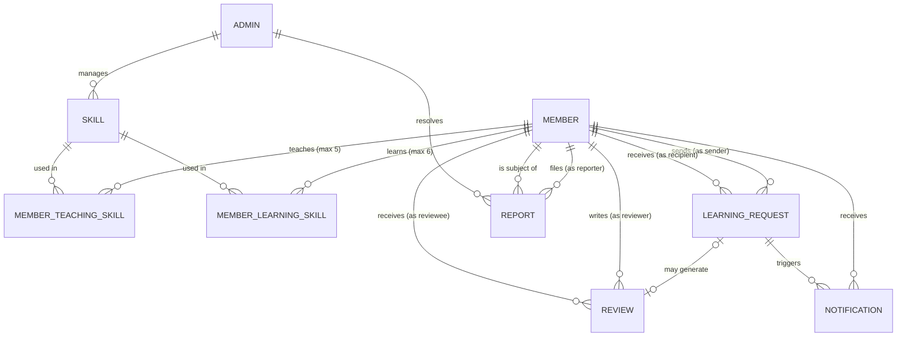
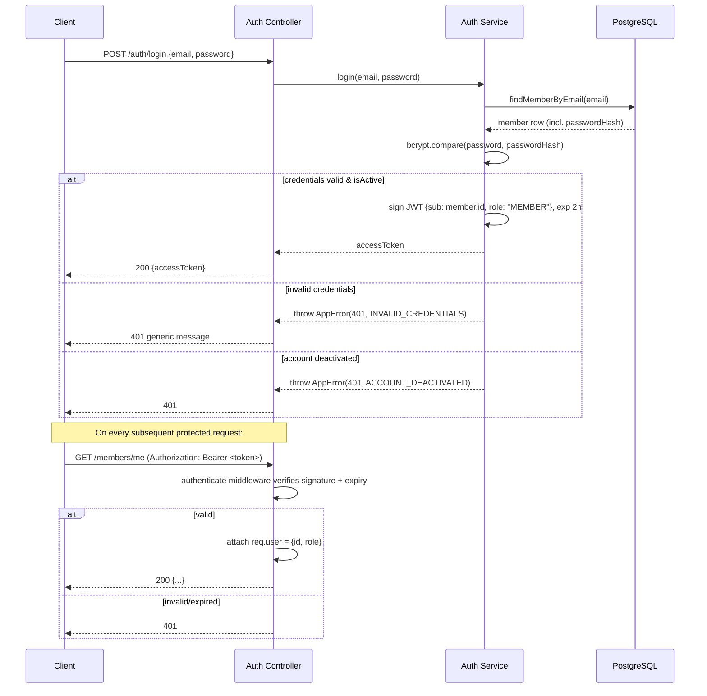
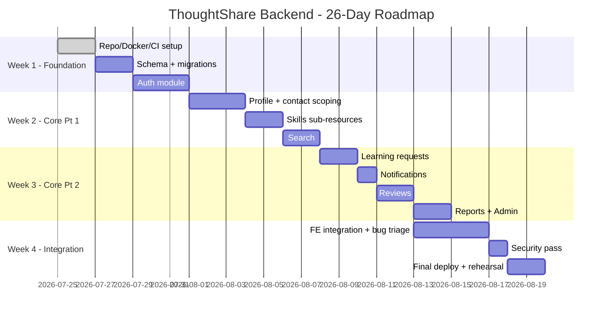

# ThoughtShare  Backend Implementation Plan

**Prepared for:** ThoughtShare Team
**Prepared as:** Principal Backend Engineer
**Source documents:** `ThoughtShare_PRD__1__updated.docx` (v1.0, Capstone MVP), `thoughtshare-ui-kit-fullboard.pdf` (UI Kit, "For team feedback" status)
**Delivery window (per PRD):** 25 July – 19 August 2026 (26 days)


---

## Table of Contents

1. [Executive Summary](#1-executive-summary)
2. [Recommended Technology Stack](#2-recommended-technology-stack)
3. [High-Level Backend Architecture](#3-high-level-backend-architecture)
4. [Project Folder Structure](#4-project-folder-structure)
5. [Database Design](#5-database-design)
6. [API Resource Breakdown](#6-api-resource-breakdown)
7. [Endpoint Specifications](#7-endpoint-specifications)
8. [Business Rules](#8-business-rules)
9. [Validation Rules](#9-validation-rules)
10. [Authentication & Authorization](#10-authentication--authorization)
11. [API Error Standard](#11-api-error-standard)
12. [Backend Development Roadmap](#12-backend-development-roadmap)
13. [Team Task Distribution](#13-team-task-distribution)
14. [Team Development Standards](#14-team-development-standards)
15. [Risks and Open Questions](#15-risks-and-open-questions)
16. [Suggested Development Order](#16-suggested-development-order)

---

## 1. Executive Summary

### Product purpose
ThoughtShare is a peer-to-peer skill exchange platform. Every member can both teach and learn  there is no separate "tutor" or "student" account type. The platform's job stops at **discovery and connection**: it helps a member find someone who teaches a skill they want (or, pending a product decision  see §15  someone who wants to learn a skill they teach), lets the two people request a connection, and once accepted, reveals each person's preferred contact method so they can continue the relationship on WhatsApp, email, or whatever they choose. ThoughtShare does not host lessons, chat, calls, scheduling, or payments in this phase.

### Core user journey (per PRD Appendix A.4 demo script)
```
Register → Build profile (teach + learn skills) → Search a skill →
Browse results (sorted by rating, then name) → Send a learning request →
Recipient accepts/declines → Contact info revealed on acceptance →
Learning happens off-platform → Requester returns to leave a rating + review
```

### Backend responsibilities
- Own all business rules and validation **server-side** the PRD is explicit (§10, §15) that hiding contact info or filtering reported members in the UI is not sufficient; it must be enforced at the query layer.
- Enforce the connection lifecycle (`PENDING → ACCEPTED` / `PENDING → DECLINED`) as the single source of truth for whether contact info may be revealed.
- Maintain a fixed, admin-curated skill library (no free-text/fuzzy skill creation).
- Compute and serve refresh-based (not real-time) notifications.
- Maintain data integrity via foreign keys, transactions on multi-step writes (accept/decline, rating recalculation), and strict scoping of sensitive fields (passwords, pre-acceptance contact info).
- Support a lightweight admin surface for report resolution, skill-library management, and review moderation.

### Backend architecture overview
A single Express.js REST API, layered (routes → middleware → controllers → services → repositories) backed by PostgreSQL via Prisma ORM, containerized with Docker for local parity across three backend developers, deployed to a managed host (provider TBD by Cloud/DevOps per PRD §12). Authentication is JWT-based per PRD §13. The architecture deliberately avoids infrastructure the PRD rules out  no WebSocket layer, no message broker, no payment gateway to keep the 26-day build achievable, matching the PRD's own philosophy: *"Ship one complete, demoable journey in 26 days rather than partial coverage of many features."*

---

## 2. Recommended Technology Stack

| Layer | Technology | Reason |
|---|---|---|
| Runtime | **Node.js 20 LTS** | Long-term support window covers the whole capstone and beyond; broad hosting compatibility. |
| Framework | **Express.js 4.x** | Specified directly in PRD §13 ("Backend: Express.js"). Minimal, unopinionated, easiest framework for a mixed-skill 3-person team to reason about under a 26-day deadline. |
| Database | **PostgreSQL 15+** | PRD §8 requires FK constraints enforced at the DB level and transactional writes Postgres gives real FKs, transactions, and partial unique indexes (used to enforce "one PENDING request per pair," §5.3). Most managed-hosting free/student tiers support it. |
| ORM | **Prisma** | Schema-first modeling maps cleanly onto PRD §7's entity list; generates migrations automatically (reduces hand-written SQL mistakes across 3 devs); type-safe client reduces a whole class of bugs students commonly hit with raw query builders. |
| Authentication | **jsonwebtoken (JWT)** | Mandated by PRD §13 and §6.1. |
| Authorization | Custom Express middleware (role check + ownership check) | PRD §10 requires "auth + ownership checks on every protected route" no off-the-shelf library does this generically; hand-rolled middleware keeps it auditable. |
| Validation | **Zod** | Schema-first validation that mirrors the Prisma schema shape; produces structured, field-level errors that map directly onto the PRD §9 error format (`error.field`). |
| File upload | **Multer** (+ local `/uploads` in dev, S3-compatible bucket in prod) | Needed for profile pictures (PRD §6.2) and "sample work" style attachments if scoped in later; Multer is the Express-ecosystem standard. |
| Password hashing | **bcrypt** (`bcryptjs` if native compilation is a problem in CI) | PRD §6.1 explicitly mandates bcrypt, minimum 10 salt rounds. |
| JWT strategy | Single **access token**, short-lived (2h), no refresh-token flow | MVP scope has no "keep me logged in for weeks" requirement in the PRD; a refresh-token/rotation system is real complexity the 26-day window doesn't need. Documented as a v2 improvement in §15. |
| Logging | **pino** (structured JSON logs) + `pino-http` for request logging | Fast, low-overhead, produces machine-parseable logs useful once deployed; pairs well with most managed-host log viewers. |
| Environment configuration | **dotenv** + **envalid** | envalid fails fast at boot if a required env var is missing/malformed  saves debugging time for students, especially across 3 backend devs' machines and CI. |
| API documentation | **swagger-jsdoc + swagger-ui-express** (OpenAPI 3) | Gives the 3 frontend engineers a live, testable contract at `/api/docs` without a separate Postman collection to keep in sync. |
| Testing framework | **Jest + Supertest** | Jest is the de facto Node standard; Supertest integrates cleanly with Express for endpoint-level integration tests (critical since PRD's acceptance criteria are Given/When/Then they map directly to Supertest cases). |
| Linting | **ESLint** (`eslint-config-airbnb-base` or `eslint-config-standard`) | Keeps style consistent across 3 backend contributors merging into the same repo. |
| Formatting | **Prettier** (run via `lint-staged` on commit) | Removes formatting bikeshedding from code review. |
| Package manager | **npm** | Ships with Node zero extra setup for students; lockfile committed. (pnpm is a fine alternative if the team wants faster installs, but adds a tool to learn.) |
| Docker | **Docker + docker-compose** | Gives all 3 backend devs an identical local Postgres + API stack, and gives Cloud/DevOps a container to deploy as-is. |
| Deployment | **Render / Railway / Fly.io** (exact provider **TBD flagged in PRD §12** for Cloud/DevOps to confirm) | All three offer free/student tiers with managed Postgres and Docker-based deploys, matching PRD §8's "reachable on a public URL" requirement without requiring the backend team to hand-roll infra. |
| CI/CD | **GitHub Actions** | Free for the team's GitHub org, runs lint + tests + (optionally) a deploy step on merge to `main`. |
| Monitoring | `/health` endpoint (liveness + DB connectivity check) + optional **Sentry** free tier for error tracking | PRD doesn't require a full observability stack, but PRD §8 does require the app be reachable/available from Phase 2 onward a health endpoint is the minimum viable way to verify that and to wire into the host's uptime checks. |

> **Assumption:** Where the PRD leaves a choice open (hosting provider, package manager, exact JWT expiry), this table states an explicit MVP-appropriate default so the team isn't blocked, but flags the ones the PRD names as someone else's decision (hosting → Cloud/DevOps, per PRD §12).

---

## 3. High-Level Backend Architecture

### Style: Layered architecture, feature-grouped within each layer
A classic **Routes → Middleware → Controllers → Services → Repositories → Database** layering (a pragmatic MVC variant), with each layer's files grouped by *feature* (auth, members, skills, requests, notifications, reviews, reports, admin) rather than dumped flat. This gives the team:
- A single, predictable place to look for anything ("where's request-accept logic?" → `services/request.service.js`).
- Clean seams for unit-testing services in isolation from HTTP (Supertest hits controllers; Jest unit tests hit services directly with a mocked repository).
- A repository layer that wraps Prisma calls, so business logic (services) never talks to the ORM directly this makes ownership/authorization checks and future DB swaps easier, and keeps controllers thin.

### Request lifecycle
```
Client Request
      │
      ▼
[1] Express Router          — matches URL + HTTP method to a route file
      │
      ▼
[2] Global Middleware       — helmet, cors, json body parser, request logger (pino-http)
      │
      ▼
[3] Rate Limiter (auth routes only) — express-rate-limit, PRD §6.1 (5 attempts/15min)
      │
      ▼
[4] Auth Middleware           — verifies JWT, attaches req.user (401 if missing/invalid/expired)
      │
      ▼
[5] Ownership/Role Middleware — e.g. "only the review's author may edit it" (PRD §10)
      │
      ▼
[6] Validation Middleware    — Zod schema validates body/params/query (400 on failure)
      │
      ▼
[7] Controller                — parses req, calls service, shapes HTTP response
      │
      ▼
[8] Service                   — business rules (skill caps, one-pending-request rule, etc.)
      │
      ▼
[9] Repository (Prisma)       — data access, wrapped in a DB transaction where PRD §8 requires it
      │
      ▼
[10] PostgreSQL
      │
      ▼
Response ── success: { success: true, data } —— error: { success: false, error }
      │
      ▼
[11] Central Error Handler    — catches thrown AppError instances, maps to PRD §9 shape + status code
```

### Dependency flow (who is allowed to import whom)
```
routes/       →  controllers/, middlewares/, validators/
controllers/  →  services/                     (never touches Prisma directly)
services/     →  repositories/, utils/, errors/
repositories/ →  database/ (Prisma client)     (never contains business rules)
middlewares/  →  services/ (for ownership checks), utils/
```
This one-directional flow is enforced by convention + code review (§14), not a build tool  appropriate for a 26-day student project where adding a dependency-graph linter would cost more setup time than it saves.

### ASCII architecture diagram
```
┌──────────────────────────────────────────────────────────────────────┐
│                              CLIENT                                  │
│              (Mobile app / Web app — per UI Kit screens)             │
└───────────────────────────────┬────────────────────────────────────-┘
                                 │ HTTPS (JSON)
                                 ▼
┌──────────────────────────────────────────────────────────────────────┐
│                         EXPRESS.JS API SERVER                        │
│  ┌────────────┐   ┌──────────────┐   ┌─────────────┐  ┌───────────┐  │
│  │  Routes    │──▶│ Middlewares  │──▶│ Controllers │──▶│ Services  │  │
│  │ (per       │   │ (auth, rate  │   │ (thin,      │   │ (business │  │
│  │  module)   │   │  limit, val) │   │  HTTP-only) │   │  rules)   │  │
│  └────────────┘   └──────────────┘   └─────────────┘  └─────┬─────┘  │
│                                                               │       │
│                                                        ┌──────▼─────┐ │
│                                                        │Repositories│ │
│                                                        │  (Prisma)  │ │
│                                                        └──────┬─────┘ │
└───────────────────────────────────────────────────────────────┼──────┘
                                                                  │
                                                                  ▼
                                                    ┌──────────────────────┐
                                                    │   PostgreSQL (RDS/   │
                                                    │  managed instance)   │
                                                    └──────────────────────┘

Cross-cutting:  Central Error Handler · pino Logger · Swagger Docs (/api/docs)
                 · /health endpoint · Docker container (app + db, local & prod)
```

---

## 4. Project Folder Structure

```
thoughtshare-backend/
├── src/
│   ├── controllers/
│   │   ├── auth.controller.js
│   │   ├── member.controller.js
│   │   ├── skill.controller.js
│   │   ├── search.controller.js
│   │   ├── request.controller.js
│   │   ├── notification.controller.js
│   │   ├── review.controller.js
│   │   ├── report.controller.js
│   │   └── admin.controller.js
│   ├── services/
│   │   ├── auth.service.js
│   │   ├── member.service.js
│   │   ├── skill.service.js
│   │   ├── search.service.js
│   │   ├── request.service.js
│   │   ├── notification.service.js
│   │   ├── review.service.js
│   │   ├── report.service.js
│   │   └── admin.service.js
│   ├── repositories/
│   │   ├── member.repository.js
│   │   ├── skill.repository.js
│   │   ├── request.repository.js
│   │   ├── notification.repository.js
│   │   ├── review.repository.js
│   │   ├── report.repository.js
│   │   └── admin.repository.js
│   ├── routes/
│   │   ├── auth.routes.js
│   │   ├── member.routes.js
│   │   ├── skill.routes.js
│   │   ├── search.routes.js
│   │   ├── request.routes.js
│   │   ├── notification.routes.js
│   │   ├── review.routes.js
│   │   ├── report.routes.js
│   │   ├── admin.routes.js
│   │   └── index.js                 # mounts all routers under /api/v1
│   ├── middlewares/
│   │   ├── authenticate.js           # verifies JWT, attaches req.user
│   │   ├── authorize.js              # role check (MEMBER vs ADMIN)
│   │   ├── ownership.js              # "only the resource owner may..."
│   │   ├── validate.js               # runs a Zod schema against req
│   │   ├── rateLimiter.js            # login attempt limiter
│   │   ├── errorHandler.js           # central error → PRD §9 response shape
│   │   └── notFound.js               # catch-all 404
│   ├── validators/                   # Zod schemas, one file per module
│   │   ├── auth.schema.js
│   │   ├── member.schema.js
│   │   ├── skill.schema.js
│   │   ├── request.schema.js
│   │   ├── review.schema.js
│   │   └── report.schema.js
│   ├── schemas/                      # shared/reusable Zod fragments (email, pagination, etc.)
│   │   └── shared.schema.js
│   ├── utils/
│   │   ├── AppError.js               # custom error class (statusCode, code, field)
│   │   ├── asyncHandler.js           # wraps async controllers, forwards errors
│   │   ├── jwt.js                    # sign/verify helpers
│   │   ├── password.js               # bcrypt hash/compare helpers
│   │   └── logger.js                 # pino instance
│   ├── config/
│   │   ├── env.js                    # envalid-validated env config
│   │   └── constants.js              # skill caps, rate limits, edit limits, etc.
│   ├── database/
│   │   └── prisma/
│   │       ├── schema.prisma
│   │       ├── migrations/           # auto-generated by `prisma migrate`
│   │       └── seed.js               # seeds skill library + demo data
│   ├── models/                       # thin domain types/DTOs re-exported from Prisma client
│   │   └── index.js
│   ├── app.js                        # Express app assembly (middleware + routes), no listen()
│   └── server.js                     # imports app, calls app.listen()
├── tests/
│   ├── unit/                         # service-layer tests, repository mocked
│   └── integration/                  # Supertest hitting real routes + test DB
├── docs/
│   └── openapi.yaml                  # generated/maintained OpenAPI spec
├── .env.example
├── .eslintrc.json
├── .prettierrc
├── Dockerfile
├── docker-compose.yml
├── package.json
└── README.md
```

### Purpose of every folder

| Folder | Purpose |
|---|---|
| `controllers/` | Translate HTTP ↔ service calls. Parse `req`, call exactly one service method, shape the `{ success, data }` response. No business logic, no direct DB access. |
| `services/` | All business rules live here: skill caps (5/6), one-pending-request check, review edit-limit, report auto-hide, rating recalculation. Framework-agnostic pure functions/classes that could be unit-tested without Express running. |
| `repositories/` | Only place Prisma is imported. Wraps queries/mutations behind small, purpose-named functions (`findPendingRequestBetween`, `incrementReviewEditCount`). Makes it possible to mock data access in unit tests and to swap ORMs later without touching services. |
| `routes/` | Declares URL + HTTP method → middleware chain → controller. No logic beyond wiring. `index.js` mounts everything under `/api/v1`. |
| `middlewares/` | Cross-cutting concerns applied to routes: authentication, authorization, ownership, validation, rate limiting, centralized error handling. |
| `validators/` | One Zod schema module per feature defines exactly what a valid request body/params/query looks like, with the field-level error messages PRD §9 requires. |
| `schemas/` | Small reusable Zod building blocks (e.g. an email schema, a UUID param schema, pagination query schema) imported by `validators/`. |
| `utils/` | Small, dependency-light helpers: custom `AppError`, async route wrapper, JWT sign/verify, bcrypt wrappers, logger instance. |
| `config/` | Centralizes environment variable loading/validation (`env.js`) and business-rule constants (`constants.js`)  e.g. `MAX_TEACHING_SKILLS = 5` lives in exactly one place, not scattered as magic numbers. |
| `database/prisma/` | `schema.prisma` is the single source of truth for the DB schema (see §5); `migrations/` is Prisma-generated (never hand-edited); `seed.js` populates the skill library (PRD §5.1 flag) and demo accounts for the Appendix A.4 demo script. |
| `models/` | Prisma auto-generates its client types from `schema.prisma`; this folder just re-exports/aliases them so the rest of the app imports `models/` instead of reaching into `@prisma/client` everywhere keeps a future ORM swap contained to two folders (`repositories/`, `models/`). |
| `tests/unit/` | Fast tests of `services/` with `repositories/` mocked  verifies business rules (e.g. "6th teaching skill is rejected") without a database. |
| `tests/integration/` | Supertest hitting real routes against a disposable test database (via `docker-compose`)  verifies the PRD's Given/When/Then acceptance criteria end-to-end. |
| `docs/` | Maintained/generated OpenAPI spec served at `/api/docs`, giving frontend engineers a live contract. |

> **Note on the prompt's example structure:** the task brief's example listed `models/`, `seeders/`, and `migrations/` as top-level siblings of `database/`. Since this plan recommends **Prisma** (§2), migrations and the schema/model definitions are Prisma-native and live under `database/prisma/`; a top-level `models/` folder is kept as a thin re-export layer for readability, and `seeders/` is represented by `database/prisma/seed.js` (Prisma's seeding convention) rather than a separate folder. If the team instead prefers **Sequelize**, the same names map 1:1 to real top-level `models/`, `migrations/`, and `seeders/` folders — flag this as a team decision if Prisma unfamiliarity becomes a blocker in Week 1.

---

## 5. Database Design

### Entities identified from PRD §7 (+ one addition, flagged)

`Member`, `Skill`, `MemberTeachingSkill` (join), `MemberLearningSkill` (join), `LearningRequest`, `Review`, `Report`, `Admin`, and **`Notification`** — not listed in PRD §7's entity list, but required to implement §6.5's Notifications Module without recomputing "what changed since last visit" from scratch on every request. Flagged as an addition, not a PRD requirement; see note under the entity table.

---

### 5.1 `Member`

| Attribute | Type | Constraints |
|---|---|---|
| `id` | UUID | PK, default `gen_random_uuid()` |
| `name` | VARCHAR(100) | NOT NULL |
| `email` | VARCHAR(255) | NOT NULL, UNIQUE |
| `passwordHash` | VARCHAR(255) | NOT NULL never returned in any API response (PRD §10) |
| `bio` | VARCHAR(500) | NULLABLE |
| `profilePictureUrl` | VARCHAR(500) | NULLABLE |
| `preferredContactType` | VARCHAR(50) | NULLABLE (e.g. `EMAIL`, `WHATSAPP`, `PHONE`, `INSTAGRAM`) — *see assumption below* |
| `preferredContactValue` | VARCHAR(255) | NULLABLE - the actual handle/number; **never returned pre-acceptance** (PRD §6.2, §10) |
| `avgRating` | DECIMAL(3,2) | NOT NULL, DEFAULT 0 - denormalized, recalculated on review create/edit (PRD §6.6) |
| `ratingCount` | INTEGER | NOT NULL, DEFAULT 0 |
| `isActive` | BOOLEAN | NOT NULL, DEFAULT true - `false` once Admin actions a report (account deactivated, cannot log in) |
| `hiddenFromSearch` | BOOLEAN | NOT NULL, DEFAULT false - `true` while a report against this member is `PENDING` (PRD §5.5) |
| `createdAt` | TIMESTAMPTZ | NOT NULL, DEFAULT now() |
| `updatedAt` | TIMESTAMPTZ | NOT NULL, auto-updated |

**Relationships:** 1—N to `MemberTeachingSkill`, `MemberLearningSkill`, `LearningRequest` (as sender and recipient), `Review` (as reviewer and reviewee), `Report` (as reporter and reported), `Notification`.
**Indexes:** UNIQUE(`email`); index on (`avgRating` DESC, `name` ASC) to serve the PRD §6.3 sort order directly; index on `hiddenFromSearch`.

> **Assumption:** The PRD names "preferred contact method" as a single profile field but never defines its shape (a phone number? a handle? a type + value pair?). Modeling it as `preferredContactType` + `preferredContactValue` is a reasonable interpretation that also lets the frontend render an icon (per the UI Kit's contact patterns), but **confirm with the product/frontend team before Week 1 ends** — see §15.

---

### 5.2 `Skill`

| Attribute | Type | Constraints |
|---|---|---|
| `id` | UUID | PK |
| `name` | VARCHAR(100) | NOT NULL, UNIQUE |
| `category` | VARCHAR(100) | NULLABLE - e.g. "Productivity", "Creative", per UI Kit's category field on the Add-a-Skill screen |
| `createdAt` | TIMESTAMPTZ | NOT NULL, DEFAULT now() |

**Relationships:** 1—N to `MemberTeachingSkill`, `MemberLearningSkill`.
**Indexes:** UNIQUE(`name`).
**Managed by:** Admin only (PRD §4.3 role matrix, §6.3).

> **Open item, not an assumption to silently resolve:** PRD §5.1 explicitly flags that *"source of the skill library is not yet decided"* and recommends the backend team pick a source by end of Phase 1. This blocks the seed script (`database/prisma/seed.js`) and therefore blocks search/browse testing. Carried into §15 as a Week 1 must-resolve item.

---

### 5.3 `MemberTeachingSkill` (join table)

| Attribute | Type | Constraints |
|---|---|---|
| `id` | UUID | PK |
| `memberId` | UUID | FK → `Member.id`, NOT NULL, `ON DELETE CASCADE` |
| `skillId` | UUID | FK → `Skill.id`, NOT NULL, `ON DELETE RESTRICT` |
| `contextNote` | VARCHAR(300) | NOT NULL - "short experience/context note" (PRD §5.2) |
| `createdAt` | TIMESTAMPTZ | NOT NULL, DEFAULT now() |

**Constraints:** UNIQUE(`memberId`, `skillId`). **Max 5 rows per `memberId` is an application-layer rule** (PRD §7 explicitly says "enforced at the application layer," not a DB CHECK, since Postgres can't natively cap row counts per group) enforced in `services/member.service.js` inside the same transaction as the insert.
**Indexes:** index on `memberId` (fast profile loads); index on `skillId` (fast search).

---

### 5.4 `MemberLearningSkill` (join table)

Identical shape to `MemberTeachingSkill`, with `reasonNote VARCHAR(300) NOT NULL` (PRD §5.2 — "short reason for learning") in place of `contextNote`, and an application-layer cap of **6** instead of 5.

---

### 5.5 `LearningRequest`

| Attribute | Type | Constraints |
|---|---|---|
| `id` | UUID | PK |
| `senderId` | UUID | FK → `Member.id`, NOT NULL |
| `recipientId` | UUID | FK → `Member.id`, NOT NULL |
| `status` | ENUM(`PENDING`,`ACCEPTED`,`DECLINED`) | NOT NULL, DEFAULT `PENDING` |
| `createdAt` | TIMESTAMPTZ | NOT NULL, DEFAULT now() |
| `updatedAt` | TIMESTAMPTZ | NOT NULL, auto-updated (set on accept/decline) |

**Constraints:**
- `CHECK (senderId <> recipientId)` - a member cannot request themselves (PRD §5.3).
- **Partial unique index:** `UNIQUE (senderId, recipientId) WHERE status = 'PENDING'` - this is the correct way to express "only one PENDING request may exist between the same sender and recipient at a time" (PRD §5.3) at the database level, not just in application code; Postgres supports partial unique indexes natively.

**Relationships:** N—1 to `Member` (twice: sender, recipient); 1—0/1 to `Review` (a completed/ACCEPTED request may generate at most one review per direction - see 5.6).
**Indexes:** index on `recipientId` + `status` (fast "requests I've received, pending"); index on `senderId` + `status`.

---

### 5.6 `Review`

| Attribute | Type | Constraints |
|---|---|---|
| `id` | UUID | PK |
| `requestId` | UUID | FK → `LearningRequest.id`, NOT NULL - the connection this review is *for* |
| `reviewerId` | UUID | FK → `Member.id`, NOT NULL |
| `revieweeId` | UUID | FK → `Member.id`, NOT NULL |
| `rating` | SMALLINT | NOT NULL, `CHECK (rating BETWEEN 1 AND 5)` |
| `reviewText` | VARCHAR(1000) | NOT NULL |
| `editCount` | SMALLINT | NOT NULL, DEFAULT 0 |
| `createdAt` | TIMESTAMPTZ | NOT NULL, DEFAULT now() |
| `updatedAt` | TIMESTAMPTZ | NOT NULL, auto-updated |

**Constraints:** UNIQUE(`reviewerId`, `revieweeId`, `requestId`) - "one review per (reviewer, reviewee, connection)" (PRD §7). `CHECK (reviewerId <> revieweeId)`.
**Business-layer rule (not a DB constraint):** `requestId.status` must be `ACCEPTED` at review-creation time (PRD §6.6 — "has not had an ACCEPTED connection" → 403).
**Indexes:** index on `revieweeId` (fast average-rating recompute and profile review lists).

---

### 5.7 `Report`

| Attribute | Type | Constraints |
|---|---|---|
| `id` | UUID | PK |
| `reporterId` | UUID | FK → `Member.id`, NOT NULL |
| `reportedMemberId` | UUID | FK → `Member.id`, NOT NULL |
| `reason` | VARCHAR(500) | NOT NULL |
| `status` | ENUM(`PENDING`,`DISMISSED`,`ACTIONED`) | NOT NULL, DEFAULT `PENDING` |
| `createdAt` | TIMESTAMPTZ | NOT NULL, DEFAULT now() |
| `resolvedAt` | TIMESTAMPTZ | NULLABLE |
| `resolvedByAdminId` | UUID | FK → `Admin.id`, NULLABLE |

**Constraints:** `CHECK (reporterId <> reportedMemberId)`. **Partial unique index:** `UNIQUE (reporterId, reportedMemberId) WHERE status = 'PENDING'` — matches PRD §7: *"a member may file multiple reports over time, not duplicate ones for an already-pending report."*
**Indexes:** index on (`reportedMemberId`, `status`) for admin queue and for the `hiddenFromSearch` sync job.

---

### 5.8 `Admin`

| Attribute | Type | Constraints |
|---|---|---|
| `id` | UUID | PK |
| `name` | VARCHAR(100) | NOT NULL |
| `email` | VARCHAR(255) | NOT NULL, UNIQUE |
| `passwordHash` | VARCHAR(255) | NOT NULL |
| `createdAt` | TIMESTAMPTZ | NOT NULL, DEFAULT now() |

**Relationships:** 1—N to `Report` (as resolver). Modeled as a **separate table**, not a role flag on `Member`, because PRD §7 lists `Admin` as its own top-level entity distinct from `Member`. Admins are not members and do not appear in search/matching.

---

### 5.9 `Notification` — *addition, not in PRD §7*

| Attribute | Type | Constraints |
|---|---|---|
| `id` | UUID | PK |
| `memberId` | UUID | FK → `Member.id`, NOT NULL - the recipient of the notification |
| `type` | ENUM(`NEW_REQUEST`,`REQUEST_ACCEPTED`,`REQUEST_DECLINED`) | NOT NULL - exactly the three triggering events in PRD §6.5 |
| `learningRequestId` | UUID | FK → `LearningRequest.id`, NOT NULL |
| `isRead` | BOOLEAN | NOT NULL, DEFAULT false |
| `createdAt` | TIMESTAMPTZ | NOT NULL, DEFAULT now() |

> **Flagged addition:** PRD §6.5 requires notifications to be "computed on page load/reload, not pushed" for these three events, but PRD §7's entity list doesn't include a `Notification` table — it's plausible the PRD author intended notifications to be *derived on the fly* from `LearningRequest` rows (e.g., "any request updated since your last login") rather than persisted. This plan recommends the persisted-row approach above because it (a) supports a real "mark as read" affordance the UI Kit's notification patterns imply, (b) is trivial to compute ("refresh-based" just means the client polls `GET /notifications` on load, not that the server can't store rows), and (c) keeps the notification list stable even if the underlying request is later modified. **Confirm this design choice with the team in Week 1** rather than treating it as settled — the derive-on-read alternative is simpler and has zero extra table.

---

### 5.10 ER Diagram (ASCII)

```
┌────────────────┐        ┌──────────────────────┐        ┌────────────────┐
│     Member      │        │ MemberTeachingSkill   │        │      Skill      │
├────────────────┤        ├──────────────────────┤        ├────────────────┤
│ id  PK          │───┐    │ id  PK                │    ┌───│ id  PK          │
│ name            │   └───▶│ memberId FK           │    │   │ name  (unique)  │
│ email  (unique) │        │ skillId  FK          │◀───┘   │ category        │
│ passwordHash    │        │ contextNote           │        │ createdAt       │
│ bio             │        │ createdAt             │        └────────────────┘
│ profilePicture  │        └──────────────────────┘                 ▲
│ preferredContact*│                                                 │
│ avgRating        │       ┌──────────────────────┐                 │
│ ratingCount      │       │ MemberLearningSkill   │                 │
│ isActive         │───┐   ├──────────────────────┤                 │
│ hiddenFromSearch │   └──▶│ id  PK                │                 │
│ createdAt/updated│       │ memberId FK           │                 │
└───────┬─────────┘       │ skillId  FK           │─────────────────┘
        │                  │ reasonNote            │
        │                  │ createdAt             │
        │                  └──────────────────────┘
        │
        │  1..N (sender)          ┌──────────────────────┐
        ├─────────────────────────▶      LearningRequest   │
        │  1..N (recipient)       ├──────────────────────┤
        ├─────────────────────────▶ id PK                 │
        │                          │ senderId    FK ──────┼───┐
        │                          │ recipientId FK ──────┼───┤ (both → Member.id)
        │                          │ status                │   │
        │                          │ created/updatedAt     │   │
        │                          └──────────┬────────────┘   │
        │                                     │ 0..1            │
        │                                     ▼                 │
        │                          ┌──────────────────────┐    │
        │  1..N (reviewer)         │        Review          │    │
        ├─────────────────────────▶├──────────────────────┤    │
        │  1..N (reviewee)         │ id PK                  │    │
        ├─────────────────────────▶│ requestId    FK        │    │
        │                          │ reviewerId   FK ───────┼────┘
        │                          │ revieweeId   FK        │
        │                          │ rating / reviewText     │
        │                          │ editCount               │
        │                          └──────────────────────┘
        │
        │  1..N (reporter)         ┌──────────────────────┐        ┌────────────────┐
        ├─────────────────────────▶│        Report          │───────▶│      Admin      │
        │  1..N (reportedMember)   ├──────────────────────┤ N..1   ├────────────────┤
        ├─────────────────────────▶│ id PK                  │ resolvedBy│ id PK          │
        │                          │ reporterId FK          │        │ name/email      │
        │                          │ reportedMemberId FK    │        │ passwordHash    │
        │                          │ reason / status         │        └────────────────┘
        │                          │ resolvedAt/By           │
        │                          └──────────────────────┘
        │
        │  1..N                    ┌──────────────────────┐
        └─────────────────────────▶│     Notification*      │
                                    ├──────────────────────┤
                                    │ id PK                  │
                                    │ memberId FK             │
                                    │ type                    │
                                    │ learningRequestId FK    │
                                    │ isRead / createdAt      │
                                    └──────────────────────┘
                                    * addition, not in PRD §7 — see 5.9
```

### 5.11 ER Diagram (Mermaid — for renderers that support it)



### 5.12 Relationship explanation
- **Member ↔ Skill** is many-to-many, realized through two *separate* join tables (`MemberTeachingSkill`, `MemberLearningSkill`) rather than one join table with a "type" column - this is deliberate: teaching and learning rows have different note fields (`contextNote` vs `reasonNote`) and different caps (5 vs 6), so two tables keep the application-layer cap check and the notes schema simple instead of branching on a type flag everywhere.
- **Member ↔ Member via LearningRequest** is a self-referencing many-to-many, disambiguated by the `senderId`/`recipientId` role columns. The partial unique index is what actually encodes the PRD's "one pending request per pair" rule — this is a database-level guarantee, not just an application check, which matters because it protects against race conditions (two near-simultaneous requests from the same sender).
- **LearningRequest ↔ Review** is one-to-zero-or-one *per direction*: since `Review` is unique on `(reviewerId, revieweeId, requestId)`, a single `ACCEPTED` request can generate up to two reviews (each party reviewing the other), but never two reviews from the same reviewer for the same request.
- **Member ↔ Report** is two distinct relationships (reporter, reported) on the same table mirrors the `LearningRequest` sender/recipient pattern.
- **Admin ↔ Report / Skill** - admins resolve reports and curate the skill library; they never appear as a `Member` and never participate in `LearningRequest`, `Review`, or `Notification`.

---

## 6. API Resource Breakdown

All routes are versioned under `/api/v1`. 🔒 = requires a valid JWT. 👑 = requires Admin JWT. 🔓 = public.

### Authentication
```
POST   /api/v1/auth/register           🔓  Create a new member account
POST   /api/v1/auth/login              🔓  Authenticate, receive JWT
GET    /api/v1/auth/me                 🔒  Return the authenticated member's own record
POST   /api/v1/auth/logout             🔒  Client-side token discard convenience endpoint*
```
`*` — not in PRD; JWT is stateless so "logout" has no server state to change under this plan's no-refresh-token design. Included for API completeness/FE convenience; see note in §7.

### Members / Profile
```
GET    /api/v1/members/me              🔒  Full own profile (includes contact info)
PUT    /api/v1/members/me              🔒  Edit own profile (bio, picture, contact method)
GET    /api/v1/members/:id             🔒  View another member's public profile
```

### Teaching / Learning Skills (sub-resource of Member)
```
POST   /api/v1/members/me/teaching-skills            🔒  Add a teaching skill (max 5)
PUT    /api/v1/members/me/teaching-skills/:skillId    🔒  Edit the context note
DELETE /api/v1/members/me/teaching-skills/:skillId    🔒  Remove a teaching skill
POST   /api/v1/members/me/learning-skills             🔒  Add a learning skill (max 6)
PUT    /api/v1/members/me/learning-skills/:skillId    🔒  Edit the reason note
DELETE /api/v1/members/me/learning-skills/:skillId    🔒  Remove a learning skill
```

### Skill Library (Discovery data source)
```
GET    /api/v1/skills                   🔓  List the fixed skill library (for pickers/search autocomplete)
```

### Search / Discovery
```
GET    /api/v1/search?skill=&mode=      🔒  Search members by skill; mode=teach|learn (see §15 open question)
```

### Learning Requests (Matching Module)
```
POST   /api/v1/requests                 🔒  Send a request to another member
GET    /api/v1/requests?type=&status=   🔒  List own sent/received requests
GET    /api/v1/requests/:id             🔒  View a single request
PATCH  /api/v1/requests/:id/accept      🔒  Accept a received PENDING request
PATCH  /api/v1/requests/:id/decline     🔒  Decline a received PENDING request
```

### Notifications
```
GET    /api/v1/notifications            🔒  List notifications for the authenticated member
PATCH  /api/v1/notifications/:id/read   🔒  Mark one notification as read
PATCH  /api/v1/notifications/read-all   🔒  Mark all as read
```

### Reviews & Ratings
```
POST   /api/v1/reviews                  🔒  Create a review for a completed (ACCEPTED) connection
PUT    /api/v1/reviews/:id              🔒  Edit own review (max 2 edits)
GET    /api/v1/members/:id/reviews      🔒  List reviews received by a member
```

### Reports (Trust & Safety)
```
POST   /api/v1/reports                  🔒  Report another member
```

### Admin
```
POST   /api/v1/admin/auth/login                👑🔓  Admin login (separate credential space)
GET    /api/v1/admin/reports?status=            👑  List reports (default: pending queue)
PATCH  /api/v1/admin/reports/:id/dismiss        👑  Dismiss a report, restore visibility
PATCH  /api/v1/admin/reports/:id/action         👑  Action a report, deactivate the member
GET    /api/v1/admin/members                    👑  List/search members (support tooling)
DELETE /api/v1/admin/reviews/:id                👑  Remove a review that violates guidelines
POST   /api/v1/admin/skills                     👑  Add a skill to the library
PUT    /api/v1/admin/skills/:id                 👑  Edit a skill
DELETE /api/v1/admin/skills/:id                 👑  Remove a skill from the library
```

### Ops
```
GET    /health                          🔓  Liveness + DB connectivity check
GET    /api/docs                        🔓  Swagger UI (OpenAPI contract)
```

---

## 7. Endpoint Specifications

> Full request/response/validation/business-rule detail is given for every endpoint that carries a PRD-stated business rule or acceptance criterion. Simple CRUD reads (e.g. `GET /skills`, `GET /health`) are specified more briefly since they carry no special business logic.

### 7.1 `POST /api/v1/auth/register`

**Description:** Creates a new member account. Every member can teach and learn  there is no role selection at registration (PRD §4.1).

**Request body:**
```json
{
  "name": "Amara Nwosu",
  "email": "amara@email.com",
  "password": "Str0ngPass!"
}
```

**Success response — `201 Created`:**
```json
{
  "success": true,
  "data": {
    "member": {
      "id": "b3a1...",
      "name": "Amara Nwosu",
      "email": "amara@email.com",
      "createdAt": "2026-07-25T09:00:00.000Z"
    },
    "accessToken": "eyJhbGciOi..."
  }
}
```

**Error responses:**
| Status | Code | When |
|---|---|---|
| 400 | `VALIDATION_ERROR` | Missing/malformed field (see §9 for field rules) |
| 409 | `EMAIL_TAKEN` | Email already registered |

**Validation rules:** `name` required, 2–100 chars. `email` required, valid format, unique. `password` min 8 chars, ≥1 uppercase, ≥1 number (PRD §6.1).

**Business rules:** Password is hashed with bcrypt (≥10 salt rounds) before storage; raw password never logged or stored.

**Acceptance criteria (derived from PRD §6.1):**
- Given a unique, valid email/password, when registering, then a member row is created and a JWT is returned.
- Given an email already in use, when registering, then `409 EMAIL_TAKEN` is returned.

---

### 7.2 `POST /api/v1/auth/login`

**Request body:**
```json
{ "email": "amara@email.com", "password": "Str0ngPass!" }
```

**Success response — `200 OK`:**
```json
{ "success": true, "data": { "accessToken": "eyJhbGciOi...", "expiresIn": 7200 } }
```

**Error responses:**
| Status | Code | When |
|---|---|---|
| 401 | `INVALID_CREDENTIALS` | Wrong email or password - **generic message, no user enumeration** (PRD §6.1 acceptance criterion) |
| 429 | `TOO_MANY_ATTEMPTS` | 6th attempt within 15 minutes for the same account/IP |

**Business rules:**
- Rate limit: 5 attempts / 15 minutes per account **and** per IP (PRD §6.1). Implemented via `express-rate-limit` keyed on `email + ip`.
- On failure, the same `401 "invalid credentials"` message is returned whether the email doesn't exist or the password is wrong — no enumeration leakage.

**Acceptance criteria (PRD §6.1, verbatim mapping):**
- Given valid credentials → 200 + JWT.
- Given invalid credentials → 401 generic message.
- Given 5 failed attempts in 15 min → 6th attempt returns 429 and the account/IP is temporarily locked.
- Given an expired token on any protected route → 401.

---

### 7.3 `GET /api/v1/auth/me` 🔒

Returns the authenticated member's own full record (including `preferredContactValue`, since a member always sees their own contact info). No params/body.

**Success — `200 OK`:**
```json
{ "success": true, "data": { "id": "b3a1...", "name": "Amara Nwosu", "email": "amara@email.com",
  "bio": "...", "preferredContactType": "WHATSAPP", "preferredContactValue": "+234...",
  "avgRating": 4.9, "ratingCount": 12 } }
```
`passwordHash` is never included (PRD §10).

---

### 7.4 `POST /api/v1/auth/logout` 🔒

**Not a PRD requirement** - added for API completeness. Since this plan's JWT strategy is stateless (§2, §10), this endpoint has no server-side session to invalidate under the MVP design; it exists purely so the frontend has a symmetric call to make (server responds `200`, client discards the token locally). If the team later adopts a token-blocklist or refresh-token rotation (see §15 as a v2 idea), this endpoint becomes meaningful server-side.

---

### 7.5 `PUT /api/v1/members/me` 🔒

**Description:** Edit own profile — picture, bio, preferred contact method. Teaching/learning skills are edited via their own sub-resource endpoints (7.9–7.10), not this one.

**Request body:**
```json
{
  "bio": "Comms officer by day, spreadsheet nerd by night.",
  "preferredContactType": "WHATSAPP",
  "preferredContactValue": "+2348012345678"
}
```
(`profilePictureUrl` is set via a separate `multipart/form-data` upload - see 7.6.)

**Success — `200 OK`:** returns the updated profile (same shape as 7.3).

**Validation rules:** `bio` optional, max 500 chars (PRD §6.2). `preferredContactType` one of the enum values; `preferredContactValue` required if `preferredContactType` is set, max 255 chars.

**Business rules:** Changes are reflected immediately in subsequent search/browse results (PRD §6.2 acceptance criterion) no caching layer sits in front of member reads in this MVP, so this is satisfied by default; flagged so it isn't accidentally broken by adding a naive cache later without invalidation.

---

### 7.6 `POST /api/v1/members/me/picture` 🔒

**Description:** Upload/replace profile picture via Multer (`multipart/form-data`, field name `picture`).
**Validation:** JPEG/PNG/WebP only, max 5MB (MVP-reasonable default — not PRD-specified, flagged as assumption).
**Success — `200 OK`:** `{ "success": true, "data": { "profilePictureUrl": "https://.../amara.jpg" } }`

---

### 7.7 `GET /api/v1/members/:id` 🔒

**Description:** View another member's public profile.

**Success — `200 OK`:**
```json
{
  "success": true,
  "data": {
    "id": "f9c2...",
    "name": "Tunde Alabi",
    "bio": "Edited for 3 YouTube channels.",
    "avgRating": 4.8,
    "ratingCount": 9,
    "teachingSkills": [{ "skill": "Video editing", "contextNote": "3 years freelance." }],
    "learningSkills": [{ "skill": "Excel", "reasonNote": "Want pivot tables." }],
    "preferredContactType": null,
    "preferredContactValue": null
  }
}
```

**Business rules (critical — PRD §6.2, §10):**
- `preferredContactValue` (and, for consistency, `preferredContactType`) is `null`/omitted **unless** there exists an `ACCEPTED` `LearningRequest` between the viewer and this member. This check happens **in the repository query itself** the field is not fetched-then-stripped in the controller, per PRD §10: *"scoped at the query level... regardless of what the client asks for."*
- If `:id` refers to a member who is currently `hiddenFromSearch = true` **and** the viewer has no prior `ACCEPTED` connection with them, return `404 NOT_FOUND` rather than revealing the account exists but is hidden (avoids leaking report status).

**Error responses:** `404 NOT_FOUND` if the member doesn't exist or is hidden-and-unconnected to the viewer.

---

### 7.8 `GET /api/v1/skills` 🔓

Returns the full fixed skill library (id, name, category), used to populate skill pickers (UI Kit screens 02 "Onboarding skill picker" and 07 "Add a skill") and to validate search terms client-side before submission. No pagination needed at MVP scale; add if the library grows large.

---

### 7.9 `POST /api/v1/members/me/teaching-skills` 🔒

**Request body:**
```json
{ "skillId": "e21a...", "contextNote": "Built budgeting models for 3 NGOs." }
```

**Success — `201 Created`:** the created `MemberTeachingSkill` row.

**Error responses:**
| Status | Code | When |
|---|---|---|
| 400 | `MAX_TEACHING_SKILLS_REACHED` | Member already has 5 teaching skills |
| 400 | `INVALID_SKILL` | `skillId` doesn't exist in the library |
| 409 | `SKILL_ALREADY_ADDED` | Member already teaches this skill |

**Validation rules:** `skillId` required, must reference an existing `Skill`. `contextNote` required, non-empty, max 300 chars (PRD §6.2).

**Acceptance criteria (PRD §6.2, verbatim):** *Given a member tries to add a 6th teaching skill, when submitted, then the API rejects with `400 "maximum 5 teaching skills."`*

---

### 7.10 `POST /api/v1/members/me/learning-skills` 🔒

Same shape as 7.9, with `reasonNote` in place of `contextNote`, cap of **6** instead of 5, and error code `MAX_LEARNING_SKILLS_REACHED`.

`PUT`/`DELETE` variants of both (7.9/7.10) follow standard REST semantics: `PUT` edits the note only (skill itself is immutable once added — to change the skill, delete and re-add), `DELETE` removes the row and does not affect existing `LearningRequest`/`Review` history.

---

### 7.11 `GET /api/v1/search` 🔒

**Query parameters:**
| Param | Required | Description |
|---|---|---|
| `skill` | Yes | Must exactly match an existing `Skill.name` (or be passed as `skillId`) **no free-text/fuzzy matching** (PRD §6.3) |
| `mode` | No, default `teach` | `teach` = members who teach this skill; `learn` = members who want to learn it. **Default and full support for `learn` mode is an open product decision — see §15.** |
| `page`, `pageSize` | No | Standard pagination, default `page=1&pageSize=20` |

**Success — `200 OK`:**
```json
{
  "success": true,
  "data": {
    "results": [
      { "id": "f9c2...", "name": "Tunde Alabi", "avgRating": 4.8, "ratingCount": 9,
        "teachingSkills": ["Video editing"] }
    ],
    "page": 1, "pageSize": 20, "total": 3
  }
}
```

**Error responses:** `400 SKILL_NOT_FOUND` if `skill` doesn't match a library entry (no fuzzy fallback, per PRD §6.3).

**Business rules:**
- Sort: `avgRating DESC, name ASC` (PRD §6.3, tie-break explicitly specified).
- `WHERE hiddenFromSearch = false` is applied **in this query**, not filtered client-side (PRD §6.3, §5.5, §10).
- The searching member's own record is excluded from their own results (reasonable default, not stated but implied flagged as assumption).

**Acceptance criteria (PRD §6.3, verbatim):**
- Given a search for "Excel" → only members with Excel as a *teaching* skill appear (in `mode=teach`), ordered by rating then name.
- Given two members with equal ratings → alphabetical order.
- Given a member is currently reported and unresolved → excluded from results.

---

### 7.12 `POST /api/v1/requests` 🔒

**Description:** Send a learning request to another member.

**Request body:**
```json
{ "recipientId": "f9c2..." }
```

**Success — `201 Created`:**
```json
{ "success": true, "data": { "id": "9a11...", "senderId": "b3a1...", "recipientId": "f9c2...",
  "status": "PENDING", "createdAt": "2026-07-26T10:00:00.000Z" } }
```

**Error responses:**
| Status | Code | When |
|---|---|---|
| 400 | `SELF_REQUEST` | `recipientId === req.user.id` |
| 404 | `RECIPIENT_NOT_FOUND` | Recipient doesn't exist |
| 409 | `REQUEST_ALREADY_PENDING` | A PENDING request already exists between this sender/recipient pair |

**Business rules:** No reciprocity check required sender/recipient don't need matching teach/learn skills (PRD §5.3). The uniqueness check relies on the partial unique DB index (§5.5) as the ultimate guard against race conditions; the service layer also checks first to return a clean `409` rather than a raw DB constraint error.
**Side effect:** creates a `NEW_REQUEST` notification for the recipient (PRD §6.5).

**Acceptance criteria (PRD §6.4, verbatim):** *Given a member sends a request while a PENDING request to the same recipient already exists, when submitted, then the API rejects with `409 "request already pending."`*

---

### 7.13 `PATCH /api/v1/requests/:id/accept` 🔒

**Ownership rule:** only the `recipientId` of the request may accept it (403 otherwise).
**Business rules:** Must currently be `PENDING` (409 `INVALID_STATE` if already `ACCEPTED`/`DECLINED`). On success, wrapped in a **DB transaction** (PRD §8 reliability requirement) that: (1) sets `status = ACCEPTED`, (2) creates a `REQUEST_ACCEPTED` notification for the sender. Both members' `preferredContactValue` become mutually visible **immediately** - this is a read-time effect of §5.5/§7.7's query-level check against `LearningRequest.status = ACCEPTED`, not a separate write.

**Success — `200 OK`:** the updated request, `status: "ACCEPTED"`.
**Error responses:** `403 NOT_RECIPIENT`, `404 NOT_FOUND`, `409 INVALID_STATE`.

**Acceptance criteria (PRD §6.4, verbatim):** *Given a recipient accepts a request, when the action completes, then both members can now see each other's preferred contact method.*

---

### 7.14 `PATCH /api/v1/requests/:id/decline` 🔒

Same ownership/state rules as 7.13, sets `status = DECLINED`, creates a `REQUEST_DECLINED` notification for the sender. No contact info is ever revealed (PRD §6.4 acceptance criterion) trivially true since the reveal condition (7.7) only checks for `ACCEPTED`.

---

### 7.15 `GET /api/v1/notifications` 🔒

**Query parameters:** `unreadOnly=true|false` (default `false`).
**Description:** Computed/returned on-demand when the client loads or refreshes the app (PRD §6.5 - "refresh-based, not real-time"). No WebSocket/push channel exists in this architecture.

**Success - `200 OK`:**
```json
{ "success": true, "data": [
  { "id": "n1...", "type": "REQUEST_ACCEPTED", "learningRequestId": "9a11...", "isRead": false,
    "createdAt": "2026-07-26T12:00:00.000Z" }
] }
```

**Acceptance criteria (PRD §6.5, verbatim):**
- Given a member receives a new request, when they next load/refresh, then a notification indicating the new request is shown.
- Given a request is accepted/declined, when the sender next refreshes, then they see the corresponding status update.

---

### 7.16 `POST /api/v1/reviews` 🔒

**Request body:**
```json
{ "requestId": "9a11...", "rating": 5, "reviewText": "Great at explaining pivot tables!" }
```

**Success — `201 Created`:** the created review; **wrapped in a transaction** that also recalculates `revieweeId.avgRating`/`ratingCount` (PRD §8 reliability requirement, §6.6 acceptance criterion).

**Error responses:**
| Status | Code | When |
|---|---|---|
| 403 | `NO_ACCEPTED_CONNECTION` | No `ACCEPTED` request exists between reviewer and reviewee for this `requestId` |
| 409 | `REVIEW_ALREADY_EXISTS` | Reviewer already reviewed this connection — must use `PUT /reviews/:id` instead |
| 400 | `VALIDATION_ERROR` | Rating out of 1–5 range, or review text missing/too long |

**Business rules:** `revieweeId` is derived server-side as "the *other* party on `requestId`" - never trusted from the client - to prevent a reviewer naming an arbitrary third party as the reviewee.

**Acceptance criteria (PRD §6.6, verbatim):**
- No ACCEPTED connection → 403.
- Duplicate review for same connection → 409, must edit instead.
- On save, reviewee's average star rating recalculates.

---

### 7.17 `PUT /api/v1/reviews/:id` 🔒

**Ownership rule:** only `reviewerId` may edit (403 otherwise).
**Business rules:** rejected with `403 EDIT_LIMIT_REACHED` once `editCount` would exceed 2 (PRD §6.6 default, flagged as tunable — see §15 open question on exact number/time-boxing). Each successful edit increments `editCount` and re-triggers the `avgRating` recalculation transaction.

**Acceptance criteria (PRD §6.6, verbatim):** *Given a member has already edited a review twice, when they attempt a third edit, then the API rejects with `403 "edit limit reached."`*

---

### 7.18 `POST /api/v1/reports` 🔒

**Request body:**
```json
{ "reportedMemberId": "f9c2...", "reason": "Inappropriate messages outside the platform." }
```

**Success — `201 Created`:** the created report, `status: "PENDING"`.
**Side effect (same transaction):** sets `reportedMember.hiddenFromSearch = true` **immediately** (PRD §6.7, §5.5 — "automatically hidden... while the report is pending").

**Error responses:** `400 SELF_REPORT` (`reportedMemberId === req.user.id`), `409 REPORT_ALREADY_PENDING` (this reporter already has a pending report against this member).

**Acceptance criteria (PRD §6.7, verbatim):** *Given a member submits a report, when it is saved, then the reported member is immediately excluded from search/browse results.*

---

### 7.19 `PATCH /api/v1/admin/reports/:id/dismiss` 👑

Sets `status = DISMISSED`, `resolvedAt`, `resolvedByAdminId`; **in the same transaction**, sets `reportedMember.hiddenFromSearch = false` **only if no other PENDING report exists against that same member** (edge case not explicit in PRD, handled conservatively — flagged as assumption).

**Acceptance criteria (PRD §6.7, verbatim):** *Given an Admin dismisses a report, when resolved, then the reported member is reinstated in search/browse results.*

---

### 7.20 `PATCH /api/v1/admin/reports/:id/action` 👑

Sets `status = ACTIONED`; in the same transaction sets `reportedMember.isActive = false` (member can no longer log in - enforced in `auth.service.js`'s login check) and leaves `hiddenFromSearch = true`.

**Acceptance criteria (PRD §6.7, verbatim):** *Given an Admin actions a report, when resolved, then the reported member's account is deactivated and they can no longer log in.*

---

### 7.21 Admin skill-library CRUD (`POST` / `PUT` / `DELETE /api/v1/admin/skills[/:id]`) 👑

Standard CRUD. `DELETE` is `RESTRICT`ed at the FK level (§5.3) — deleting a `Skill` that's still referenced by any `MemberTeachingSkill`/`MemberLearningSkill` row returns `409 SKILL_IN_USE` rather than silently cascading, since silently deleting a skill out from under members' profiles would violate PRD §10's data-integrity intent even though it doesn't say so explicitly (flagged as assumption).

---

### 7.22 `DELETE /api/v1/admin/reviews/:id` 👑

Hard-deletes a review that violates guidelines (PRD §4.2 "moderate reviews... remove if necessary"). **Side effect:** must re-trigger the reviewee's `avgRating`/`ratingCount` recalculation in the same transaction, or the average silently goes stale - called out explicitly since it's an easy bug to miss.

---

### 7.23 `GET /health` 🔓

```json
{ "success": true, "data": { "status": "ok", "db": "connected", "uptime": 12345 } }
```
Returns `503` if the DB ping fails. Supports PRD §8's availability requirement and gives Cloud/DevOps a target for uptime checks.

---

## 8. Business Rules

Extracted from the PRD, presented as an implementation checklist. Each maps to a PRD section.

**Profile & Skills**
- [ ] A member has at most **5** teaching skills (PRD §5.2, §6.2).
- [ ] A member has at most **6** learning skills (PRD §5.2, §6.2).
- [ ] Every teaching skill has a non-empty context note; every learning skill has a non-empty reason note (PRD §5.2, §6.2).
- [ ] Skills are drawn only from the fixed library — no free-text/custom skills in v1 (PRD §5.1, §6.3).
- [ ] Bio is optional, max 500 characters (PRD §6.2).
- [ ] Preferred contact method is never returned in any public/browse response (PRD §6.2).

**Matching / Requests**
- [ ] A connection does not require reciprocal skills (PRD §5.3).
- [ ] Only one `PENDING` request may exist per (sender, recipient) pair at a time (PRD §5.3).
- [ ] A member cannot send a request to themselves (PRD §5.3).
- [ ] Request lifecycle is exactly `PENDING → ACCEPTED` or `PENDING → DECLINED` — no other transitions (PRD §5.4).
- [ ] On acceptance, both members' contact methods become mutually visible immediately (PRD §5.4, §6.4).
- [ ] On decline, no contact info is revealed to either party (PRD §6.4).

**Search / Discovery**
- [ ] Results sorted by average rating (desc), then alphabetically by name on ties (PRD §6.3).
- [ ] Search term must match an existing library skill exactly — no fuzzy/free-text (PRD §6.3).
- [ ] Reported-and-pending members are excluded from search/browse (PRD §5.5, §6.3).

**Reviews & Ratings**
- [ ] One star rating (1–5) + written review per completed connection (PRD §6.6).
- [ ] A member can edit their own review up to **2** times (default, tunable — PRD §6.6, §11).
- [ ] No review without a prior `ACCEPTED` connection between the two members (PRD §6.6).
- [ ] No duplicate review for the same (reviewer, reviewee, connection) — must edit instead (PRD §6.6, §7).
- [ ] Reviewee's average rating recalculates on every review create/edit (PRD §6.6).

**Trust & Safety / Reporting**
- [ ] A member cannot report themselves (PRD §6.7).
- [ ] A report requires a non-empty reason (PRD §6.7).
- [ ] A reported member is hidden from search/browse **immediately** on report submission, not deleted, not notified (PRD §5.5, §6.7).
- [ ] An already-`ACCEPTED` request involving a now-reported member is unaffected while the report is pending (PRD §5.5) - *open question on whether this should also apply to contact-info visibility if the report is later actioned; see §15.*
- [ ] Admin dismissal restores full visibility; admin action keeps the account deactivated (PRD §5.5, §6.7).

**Security / Data Integrity**
- [ ] Every protected route runs through JWT authentication middleware (PRD §10).
- [ ] Ownership checks apply wherever "own resource" language appears (e.g., only a review's author may edit it) (PRD §10).
- [ ] Contact info is scoped at the query level, never returned pre-acceptance regardless of client request shape (PRD §10).
- [ ] Passwords are never returned in any API response, including nested objects (PRD §10).
- [ ] Reported-member exclusion is enforced server-side in the query, not filtered client-side (PRD §10).
- [ ] Foreign-key constraints enforced at the DB level (PRD §8).
- [ ] Request accept/decline and rating-average recalculation are wrapped in DB transactions (PRD §8).

---

## 9. Validation Rules

### Auth
| Field | Required | Min/Max | Rule | Error message |
|---|---|---|---|---|
| `name` | Yes | 2–100 chars | - | "Name must be between 2 and 100 characters." |
| `email` | Yes | ≤255 chars | RFC 5322 format, unique | "Enter a valid, unused email address." |
| `password` | Yes | ≥8 chars | ≥1 uppercase, ≥1 digit | "Password must be at least 8 characters and include an uppercase letter and a number." |

### Profile
| Field | Required | Min/Max | Rule | Error message |
|---|---|---|---|---|
| `bio` | No | ≤500 chars | - | "Bio must be 500 characters or fewer." |
| `preferredContactType` | No* | - | one of `EMAIL, WHATSAPP, PHONE, INSTAGRAM` | "Unsupported contact method." |
| `preferredContactValue` | Conditional | ≤255 chars | required if `preferredContactType` set | "Provide a value for your selected contact method." |

### Teaching / Learning Skills
| Field | Required | Min/Max | Rule | Error message |
|---|---|---|---|---|
| `skillId` | Yes | - | must exist in `Skill` table | "That skill isn't in the library." |
| `contextNote` / `reasonNote` | Yes | 1–300 chars | non-empty | "Add a short note before saving this skill." |
| — (row count) | - | ≤5 (teaching) / ≤6 (learning) | app-layer count check | "Maximum 5 teaching skills." / "Maximum 6 learning skills." |

### Search
| Param | Required | Rule | Error message |
|---|---|---|---|
| `skill` | Yes | must exactly match a `Skill.name`/`id` | "No matching skill in the library." |
| `mode` | No | one of `teach, learn` | "Invalid search mode." |

### Learning Requests
| Field | Required | Rule | Error message |
|---|---|---|---|
| `recipientId` | Yes | must exist, ≠ `req.user.id` | "You can't send a request to yourself." |
| — (uniqueness) | - | no existing `PENDING` request for this pair | "You already have a pending request with this member." |

### Reviews
| Field | Required | Min/Max | Rule | Error message |
|---|---|---|---|---|
| `requestId` | Yes | - | must reference an `ACCEPTED` request involving the reviewer | "You can only review a completed connection." |
| `rating` | Yes | 1–5 | integer | "Rating must be a whole number from 1 to 5." |
| `reviewText` | Yes | 1–1000 chars | non-empty | "Review must be 1–1000 characters." |

### Reports
| Field | Required | Min/Max | Rule | Error message |
|---|---|---|---|---|
| `reportedMemberId` | Yes | - | ≠ `req.user.id`, must exist | "Invalid member to report." |
| `reason` | Yes | 1–500 chars | non-empty | "Please describe the reason for this report." |

### Skill library (Admin)
| Field | Required | Min/Max | Rule | Error message |
|---|---|---|---|---|
| `name` | Yes | 1–100 chars | unique | "That skill name already exists." |
| `category` | No | ≤100 chars | - | - |

---

## 10. Authentication & Authorization

### JWT flow (Mermaid sequence)


### Access token lifecycle
- Issued on successful login; contains `{ sub: memberId, role: "MEMBER" | "ADMIN", iat, exp }`.
- **Lifetime: 2 hours** (MVP default — not PRD-specified, flagged as assumption; short enough to limit exposure, long enough that a demo session doesn't expire mid-walkthrough).
- No refresh token / rotation in this phase (see §2, §15) - expiry means re-login, which is acceptable for a 26-day capstone MVP.
- Signed with `HS256` and a single secret (`JWT_SECRET` env var); **rotate this secret before any public demo if it's ever committed accidentally.**

### Protected routes
Every route except `POST /auth/register`, `POST /auth/login`, `POST /admin/auth/login`, `GET /skills`, `GET /health`, and `GET /api/docs` requires a valid `Authorization: Bearer <token>` header, verified by `middlewares/authenticate.js`.

### Role-based access
Two roles: `MEMBER` and `ADMIN`, carried in the JWT `role` claim. `middlewares/authorize('ADMIN')` guards every `/api/v1/admin/*` route. Members and Admins are entirely separate identity spaces (separate tables, separate login endpoints, per §5.8) — an Admin token is never valid on a member-only route and vice versa.

### Ownership checks
| Resource | Rule | Enforced by |
|---|---|---|
| Own profile edit | `member.id === req.user.id` | `middlewares/ownership.js` on `PUT /members/me` (implicit - no `:id` param) |
| Request accept/decline | `request.recipientId === req.user.id` | ownership check before service call |
| Review edit | `review.reviewerId === req.user.id` | ownership check before service call |

Ownership checks live in `middlewares/ownership.js` as small, named functions (`isRequestRecipient`, `isReviewAuthor`) rather than one generic "is-owner" function, since "owner" means a different field per resource — this keeps each check readable and testable in isolation.

### Password hashing
`bcrypt.hash(password, 10)` at registration; `bcrypt.compare` at login. Salt rounds configurable via `BCRYPT_SALT_ROUNDS` env var, default `10` per PRD §6.1's stated minimum.

### Login rate limiting
`express-rate-limit`, keyed on a composite of email + IP, `windowMs: 15 * 60 * 1000`, `max: 5`, returns `429` with `Retry-After` header on the 6th attempt (PRD §6.1).

### Token middleware (pseudocode)
```js
// middlewares/authenticate.js
async function authenticate(req, res, next) {
  const header = req.headers.authorization;
  if (!header?.startsWith('Bearer ')) {
    return next(new AppError(401, 'UNAUTHENTICATED', 'Missing or malformed token.'));
  }
  try {
    const payload = jwt.verify(header.split(' ')[1], env.JWT_SECRET);
    req.user = { id: payload.sub, role: payload.role };
    return next();
  } catch (err) {
    return next(new AppError(401, 'UNAUTHENTICATED', 'Invalid or expired token.'));
  }
}
```

---

## 11. API Error Standard

### Response envelope
**Success:**
```json
{ "success": true, "data": { } }
```

**Error:**
```json
{ "success": false, "error": { "code": "VALIDATION_ERROR", "message": "Password must be at least 8 characters.", "field": "password" } }
```
`field` is omitted when the error isn't tied to a single field (e.g. `409 REQUEST_ALREADY_PENDING`). This is the exact shape PRD §9 specifies.

### HTTP status code mapping

| Status | Meaning | Example codes |
|---|---|---|
| 200 | OK | successful read/update |
| 201 | Created | successful resource creation |
| 400 | Validation error, field-level detail | `VALIDATION_ERROR`, `MAX_TEACHING_SKILLS_REACHED`, `SELF_REQUEST`, `SELF_REPORT` |
| 401 | Authentication error | `UNAUTHENTICATED`, `INVALID_CREDENTIALS`, `ACCOUNT_DEACTIVATED` |
| 403 | Authorization error — **generic message, no leakage of what the user could have accessed** (PRD §9) | `FORBIDDEN`, `NO_ACCEPTED_CONNECTION`, `EDIT_LIMIT_REACHED` |
| 404 | Not found | `NOT_FOUND` |
| 409 | Conflict | `EMAIL_TAKEN`, `REQUEST_ALREADY_PENDING`, `REVIEW_ALREADY_EXISTS`, `REPORT_ALREADY_PENDING`, `SKILL_IN_USE` |
| 429 | Rate limited | `TOO_MANY_ATTEMPTS` |
| 500 | Unhandled server error — generic message, details only in server logs | `INTERNAL_ERROR` |

All thrown errors extend a single `utils/AppError.js` class (`statusCode`, `code`, `message`, optional `field`); the central `middlewares/errorHandler.js` is the *only* place that maps an error to an HTTP response, so every module produces the same shape without repeating `res.status(...).json(...)` boilerplate.

---

## 12. Backend Development Roadmap

Mapped onto the PRD's own 26-day window (PRD Appendix A.2) so backend milestones line up with the whole team's phases, expressed here as four weekly checkpoints.

### Week 1 - Foundation (25–31 Jul, PRD Phase 1)
- Repo scaffold: folder structure (§4), ESLint/Prettier, Docker + docker-compose (Postgres + app), `.env.example`.
- `schema.prisma` written for all 9 entities (§5); first migration run.
- Skill-library source **decided** (PRD §5.1 flag - must close this before seeding) and `seed.js` populated.
- Auth module complete: register, login, `GET /me`, JWT middleware, bcrypt, rate limiter.
- OpenAPI skeleton published at `/api/docs` so FE can start wiring against real (if empty) endpoints.
- CI pipeline (lint + test) green on `main`.

**Deliverable:** a deployed (even if empty-data) API that FE can authenticate against.

### Week 2 - Core Features, Part 1 (1–7 Aug, start of PRD Phase 2)
- Profile module: `GET/PUT /members/me`, `GET /members/:id`, contact-info scoping logic (the single most important query in the app build and test it early).
- Teaching/learning skill sub-resources with cap enforcement.
- Skill library `GET /skills`.
- Search endpoint with sort order + reported-member exclusion.

**Deliverable:** the "discovery half" of the demo script (register → profile → search) works end-to-end.

### Week 3 - Core Features, Part 2 (8–12 Aug, end of PRD Phase 2)
- Learning Requests module: send/accept/decline, partial-unique-index race condition tested.
- Notifications module.
- Reviews module: create/edit with limit, rating recalculation transaction.
- Reports module + Admin report-resolution endpoints + admin skill CRUD.

**Deliverable:** the full demo script (PRD Appendix A.4) runs end-to-end against the API via Postman/Swagger, even before FE is fully wired.

### Week 4 - Integration & Demo (13–19 Aug, PRD Phase 3)
- Integration testing against the real frontend (bug triage, CORS, payload-shape mismatches).
- Load a realistic demo dataset (multiple members, varied ratings, at least one pending report) for a clean walkthrough.
- Security pass: confirm every PRD §10 rule (contact scoping, password exclusion, ownership checks) against a checklist, not just against the happy path.
- Freeze scope - per PRD Appendix A.3, cut polish before ever cutting the critical-path chain (register → login → auth → matches → wired UI → tested).
- Final deploy + demo rehearsal.

**Deliverable:** live, public-URL demo matching PRD Appendix A.4's script.



---

## 13. Team Task Distribution

Assumes three backend engineers of similar skill level. Split follows PRD §6's module boundaries so each engineer owns whole modules end-to-end (schema → service → routes → tests), minimizing merge conflicts on shared files.

### Backend Engineer 1 - Auth, Profile, Platform Foundations
**Responsible for:**
- Authentication module (7.1–7.4): register, login, `/me`, logout, rate limiting.
- Profile module (7.5–7.10): profile edit, picture upload, teaching/learning skill sub-resources.
- Shared middleware: `authenticate`, `authorize`, `ownership`, `validate`, `errorHandler`.
- Testing infrastructure: Jest/Supertest config, test-DB docker-compose service, CI pipeline.

**Deliverables:** Weeks 1–2 per §12; owns `middlewares/`, `utils/AppError.js`, `utils/jwt.js`, `utils/password.js` as shared infrastructure other engineers depend on  **prioritize these in Week 1** since BE2/BE3 build on top of them.

**Dependencies:** none upstream (first in the chain); BE2 and BE3 depend on this engineer's middleware and `req.user` shape being stable by end of Week 1.

---

### Backend Engineer 2 - Skills, Search, Learning Requests, Notifications
**Responsible for:**
- Skill library read endpoint (7.8) and Admin skill CRUD (7.21) - schema owned jointly with BE3 (Admin surface).
- Search/Discovery module (7.11).
- Learning Requests module (7.12–7.14), including the partial-unique-index design and race-condition test.
- Notifications module (7.15).

**Deliverables:** Weeks 2–3 per §12. Owns `services/skill.service.js`, `services/search.service.js`, `services/request.service.js`, `services/notification.service.js`.

**Dependencies:** needs BE1's auth middleware and the finalized `Member`/`Skill` Prisma models (co-owned with BE3 in Week 1) before starting Week 2 work; the skill-library **source decision** (§15) blocks the seed data this engineer needs to test search meaningfully.

---

### Backend Engineer 3 - Reviews, Reports, Admin, Database, Deployment Support
**Responsible for:**
- Reviews module (7.16–7.17), including the rating-recalculation transaction.
- Reports module (7.18) and Admin report-resolution endpoints (7.19–7.20, 7.22).
- Owns `schema.prisma` end-to-end (all engineers propose changes via PR, this engineer reviews/merges schema changes to avoid migration conflicts).
- Primary liaison to Cloud/DevOps for deployment support (env vars, Docker image, `/health` endpoint).

**Deliverables:** Weeks 1 (schema), 3 (reviews/reports/admin) per §12. Owns `database/prisma/`, `services/review.service.js`, `services/report.service.js`, `services/admin.service.js`.

**Dependencies:** schema work is Week 1 critical path - everyone else waits on it; Reviews module depends on BE2's Learning Requests being functional (a review requires an `ACCEPTED` request to exist).

---

### Integration points
| Shared interface | Owner | Consumers |
|---|---|---|
| `schema.prisma` | BE3 (merge authority) | BE1, BE2 (propose via PR) |
| `req.user` shape (`{id, role}`) | BE1 | BE2, BE3 |
| `AppError` / error response shape | BE1 | BE2, BE3 |
| `LearningRequest.status` transitions | BE2 | BE3 (Reviews reads `ACCEPTED` state) |
| `Member.hiddenFromSearch` / `isActive` | BE3 (Reports sets these) | BE2 (Search reads them) |

### Merge order (Week 1)
1. BE1 merges middleware + error handling skeleton first (everything imports it).
2. BE3 merges initial `schema.prisma` + migration second (everything depends on the DB shape).
3. BE1 merges Auth module.
4. BE2 and BE3 branch off the same base from this point and work their respective modules in parallel through Weeks 2–3, syncing daily on any shared-model changes.

### Conflict avoidance
- One engineer (BE3) has merge authority on `schema.prisma` specifically to prevent three people editing the same migration file simultaneously - a common source of Prisma migration conflicts.
- Each engineer works in their own `services/*.service.js` and `routes/*.routes.js` files (module-per-file), so route/service-layer PRs rarely touch the same file.
- Shared files (`routes/index.js`, `app.js`) are edited in small, single-line-addition PRs ("mount my router") to minimize merge conflicts there too.

---

## 14. Team Development Standards

### Git workflow
- GitHub Organization repo, `main` branch protected  **no direct commits to `main`**, PRs only, minimum 1 approval before merge.
- Branch naming: `<type>/<short-description>` - e.g. `feat/auth-register`, `fix/review-edit-limit`, matching the Conventional Commits type below.
- One feature branch per endpoint or small module slice  keeps PRs reviewable within a 26-day sprint.

### Commit convention — Conventional Commits
```
feat:     new feature (e.g. "feat: add learning request accept endpoint")
fix:      bug fix
refactor: code change that neither fixes a bug nor adds a feature
docs:     documentation only
test:     adding or correcting tests
chore:    tooling, dependency bumps, config
```

### Pull Request checklist
- [ ] Linked to the relevant PRD section / task in the roadmap.
- [ ] Lint + tests pass locally and in CI.
- [ ] New/changed endpoints reflected in `docs/openapi.yaml`.
- [ ] No secrets committed (`.env` never staged — check `.gitignore`).
- [ ] Business rules from §8 relevant to this PR are covered by at least one test.

### Code review checklist
- [ ] Does business logic live in `services/`, not `controllers/` or `routes/`?
- [ ] Are ownership/authorization checks present wherever PRD §10 requires them?
- [ ] Is sensitive data (passwords, pre-acceptance contact info) excluded at the query level, not the response-shaping level?
- [ ] Are multi-step writes (accept/decline, review recalculation) wrapped in a transaction?
- [ ] Does every new error use `AppError` with the standard shape (§11)?

### Naming conventions
- **API naming:** plural nouns for collections (`/members`, `/requests`, `/reviews`), `camelCase` for JSON fields, kebab-case-free URLs use hyphens only for multi-word resources (`teaching-skills`).
- **Folder naming:** lowercase, feature-named files (`request.service.js`, not `RequestService.js`).
- **Database naming:** `camelCase` column names (Prisma default), `PascalCase` model names (`LearningRequest`), plural table names generated by Prisma's default mapping unless overridden.

### Environment variables
```
DATABASE_URL=
JWT_SECRET=
JWT_EXPIRES_IN=2h
BCRYPT_SALT_ROUNDS=10
PORT=4000
NODE_ENV=development
RATE_LIMIT_WINDOW_MS=900000
RATE_LIMIT_MAX_ATTEMPTS=5
```
`.env.example` committed with placeholder values; real `.env` git-ignored. Validated at boot via `envalid` — the app refuses to start if a required var is missing, rather than failing confusingly at first use.

### Secrets management
- No secrets in code or `docker-compose.yml` committed to the repo - use `.env` locally and the hosting provider's secret/env manager in deployment.
- `JWT_SECRET` generated fresh per environment (dev/staging/prod), never reused.

### Error handling
All thrown errors go through `AppError` → central `errorHandler` (§11). No raw `try/catch` + ad-hoc `res.status().json()` in controllers use `utils/asyncHandler.js` to forward rejected promises to the error handler automatically.

### Logging standards
- Structured JSON logs via `pino`, one line per request (method, path, status, duration, `req.user.id` if authenticated).
- Never log passwords, tokens, or full request bodies containing sensitive fields.
- `error` level for 5xx, `warn` for 4xx worth watching (e.g. repeated 401s), `info` for normal request completion.

### Documentation standards
- Every route documented in `docs/openapi.yaml` (or via `swagger-jsdoc` comments above each route) before it's considered "done," not after.
- README covers local setup: `docker-compose up`, `npx prisma migrate dev`, `npm run seed`, `npm run dev`.

### Testing requirements
- Every business rule in §8's checklist has at least one integration test asserting both the success path and the specific PRD-stated rejection (status + code).
- Minimum coverage target: all service-layer functions touched by a PR have a corresponding unit or integration test — not a percentage target, a "did you test the thing you built" norm appropriate for a 26-day project.

### Definition of Done
A backend task is "done" when:
- [ ] Code merged to `main` via reviewed PR.
- [ ] Server-side validation enforced (not just relied on client-side) matches PRD §15's release-level Definition of Done.
- [ ] Relevant §8 business rules covered by tests.
- [ ] Endpoint documented in OpenAPI.
- [ ] Manually verified against Swagger UI or Postman using the PRD's Given/When/Then acceptance criteria for that feature.

---

## 15. Risks and Open Questions

### 15.1 The UI Kit depicts features the PRD explicitly excludes - **needs a team decision, not a silent resolution**
The UI Kit's screens 04–05 (Pro-badged match cards, "Book instead" CTA, a full chat thread with a pinned swap-proposal card) and 07–09 (Upgrade to Pro paywall, professional booking with pricing) all describe a **ThoughtShare Pro** tier and in-app messaging. PRD §3 lists internal messaging, payments/subscriptions, and (implicitly, via §14 "ThoughtShare Pro - verified professionals, paid mentorship... professional badges") the entire Pro tier as **out of scope for this phase**, and PRD §14 frames these as future roadmap, suggesting the interface may include only "a non-functional 'Coming Soon' section" for them.
**Recommendation:** Backend builds *only* to PRD §6 module scope (this document does not implement chat, booking, or payments). If the frontend team intends to render the Pro/chat/booking screens as-is for the demo, they should be **static/non-functional** (matching PRD §14's own suggestion), not backed by real endpoints flag this explicitly to the frontend leads before Week 2 so they don't build against APIs that won't exist. If the team wants a *functional* Pro/chat/booking slice for the demo, that is a scope-and-timeline decision for the whole team (not backend alone) given the 26-day window, and should be explicitly re-scoped rather than discovered late.

### 15.2 Skill library source is undecided (PRD §5.1, flagged directly in the PRD)
Blocks `seed.js` and therefore blocks any meaningful search/browse testing. **Recommendation:** backend team picks a source (a public skills taxonomy or a curated static list of ~30–50 skills covering the demo script's "Excel"/"Video editing" categories) by end of Week 1 - this is explicitly called out as a backend-team decision in the PRD itself.

### 15.3 Review edit limit - exact number unconfirmed (PRD §6.6, §12)
PRD defaults to 2 edits but flags it as "team can tune this once UX is validated," and separately raises whether it should instead be time-boxed (editable within 48 hours) rather than count-based. **Recommendation:** ship the count-based version (simpler, already specified as the default) for the MVP; revisit only if user testing surfaces a real problem — not worth redesigning mid-sprint on a hypothetical.

### 15.4 Hosting provider undecided (PRD §12, §13)
Blocks final deployment configuration (connection strings, Docker registry, CI deploy step). **Recommendation:** Cloud/DevOps confirms by end of Week 1 so the app/db can be provisioned in parallel with Week 2 feature work, not bolted on in Week 4.

### 15.5 Does a pending report affect an already-`ACCEPTED` connection's contact visibility? (PRD §12, explicitly an open question)
PRD §5.5 says already-accepted connections are "unaffected" while a report is *pending*, but PRD §12 separately asks whether this should change once a report is *actioned* (member deactivated). **Recommendation:** for MVP, leave already-revealed contact info as-is even after an actioned report the platform's stated job (§1) ends at "reveal contact info," and retroactively hiding it after two people have already exchanged it off-platform achieves little. Worth a one-line team decision, not a build blocker.

### 15.6 Is search teach-only, or does it also surface people who *want to learn* a skill? (PRD §12, explicitly an open question)
Directly relevant to the UI Kit's "Learn: Video editing" filter pattern on the Matches/Feed screen. This plan's design (§7.11 `mode=teach|learn` query param) supports both without extra schema work, defaulting to `teach` to match the PRD's own primary acceptance-criteria example (§6.3: *"searches 'Excel'... only members with Excel as a teaching skill appear"*). **Recommendation:** confirm the default and whether `learn` mode ships in MVP or is deferred the API supports either answer without rework either way.

### 15.7 `preferredContactMethod` field shape is unspecified (assumption made in §5.1)
Modeled as `type` + `value` pair; not explicitly defined in the PRD. **Recommendation:** confirm with frontend before Week 2, since it affects the profile-edit form contract.

### 15.8 `Notification` table is an addition, not a PRD-listed entity (§5.9)
**Recommendation:** confirm the persisted-row design vs. a simpler derive-on-read approach in Week 1 planning low risk either way, but worth a five-minute team conversation before building on top of it.

### 15.9 Frontend framework not specified in source docs (PRD §13, flagged in the PRD itself for FE leads)
Not a backend blocker, but affects CORS configuration and the API's response shape assumptions (e.g., pagination conventions frontend frameworks commonly expect). No backend action needed beyond noting it.

### 15.10 No refresh-token strategy (this plan's own design choice, §2/§10)
A 2-hour access token with no renewal means a demo running long, or a user leaving a tab open, will need to re-login. **Recommendation:** acceptable for MVP; if it becomes a real friction point in Week 4 rehearsals, the cheapest fix is bumping `JWT_EXPIRES_IN` (e.g. to 8h) rather than building refresh-token rotation this late.

---

## 16. Suggested Development Order

```
1.  Project setup (repo, Docker, CI, lint/format)
2.  Database schema (all entities, migrations)
3.  Authentication (register, login, JWT middleware)
4.  Profile (edit, view, contact-info scoping)
5.  Skill Library (seed + read endpoint)
6.  Search
7.  Learning Requests (send/accept/decline)
8.  Notifications
9.  Reviews
10. Reporting (+ Admin resolution)
11. Admin (skill CRUD, review moderation)
12. Testing (continuous throughout, hardened in Week 4)
13. Deployment
```

### Why this order minimizes blockers
- **Setup → Schema first (1–2):** every other module reads/writes the database; getting the schema stable early (owned by BE3, §13) prevents the three engineers from building against a moving target. This mirrors the PRD's own critical path (Appendix A.1: *"API contract → DB schema → Register → Login..."*).
- **Auth before everything (3):** every protected route depends on `req.user` being available; building any feature module before auth exists means either stubbing auth (wasted work, thrown away later) or blocking. PRD's critical path agrees: auth sits immediately after schema.
- **Profile before Search (4→6):** search returns member data shaped by the profile module's queries (contact-scoping logic in particular); building search against an unfinished profile layer risks re-doing the sensitive-field-scoping work twice.
- **Skill Library before Search (5→6):** search is literally "search by skill" — it cannot be meaningfully built, let alone tested, before the skill library exists and is seeded. This is also why §15.2 (skill source decision) is flagged as urgent.
- **Requests before Reviews (7→9):** a review requires a prior `ACCEPTED` request per PRD §6.6 — Reviews has a hard data dependency on Requests existing first.
- **Requests before Notifications (7→8):** all three notification trigger events (§6.5) are request state changes; Notifications has nothing to compute without Requests in place.
- **Reporting after core loop, before Admin polish (10→11):** Reporting's member-facing half (submit a report) only needs Profile+auth, but its full loop requires Admin resolution to close it out — sequencing it after the core teach/learn/request/review loop keeps the demo-critical path (PRD Appendix A.4) unblocked if time runs short, matching PRD Appendix A.3's cut-order guidance ("simplify validation to auth routes only" as the last resort, never cutting the register→login→auth→matches chain).
- **Testing and Deployment as continuous, not final, steps (12–13):** listed last only because they're the *hardening* checkpoints (Week 4 per §12's roadmap); in practice, tests are written alongside each module (per §14's Definition of Done) and a deployable container exists from Week 1 (`docker-compose up`) so Week 4 is integration and polish, not a first attempt at going live.

This order guarantees that at every checkpoint in the 26-day window, the team has a smaller-but-complete vertical slice of the PRD's core loop working end-to-end directly serving PRD §2's stated goal: *"Ship one complete, demoable journey in 26 days rather than partial coverage of many features."*


---

# PART II - EXPANDED ENGINEERING DELIVERY PLAYBOOK

> This section expands the original implementation plan into a production-style architecture and delivery document. The original sections above remain the authoritative baseline for the endpoint inventory, core business rules, validation rules, authentication decisions, roadmap, team distribution, and known open questions.

---

## 17. Architecture Decision Record Index

This section records the major technical decisions that should be visible to every backend engineer before implementation begins.

| ADR | Decision | Status | Rationale |
|---|---|---|---|
| ADR-001 | Use Node.js + Express | Accepted | Familiar, lightweight HTTP framework for MVP |
| ADR-002 | Use PostgreSQL | Accepted | Strong relational integrity and transaction support |
| ADR-003 | Use Prisma | Accepted | Type-safe schema and migration workflow |
| ADR-004 | Use JWT access tokens | Accepted | Stateless authentication suitable for MVP |
| ADR-005 | Use bcrypt | Accepted | Password hashing requirement |
| ADR-006 | Use Zod | Accepted | Runtime validation with predictable error mapping |
| ADR-007 | Use service/repository separation | Accepted | Keeps business logic independent from transport and data access |
| ADR-008 | Use transactions for stateful workflows | Accepted | Protects consistency of request, review, report, and rating operations |
| ADR-009 | Persist notifications | Accepted for MVP | Supports unread state and refresh-based delivery |
| ADR-010 | Deactivate rather than delete reported members | Accepted | Preserves historical integrity |
| ADR-011 | Version API under `/api/v1` | Accepted | Allows future breaking changes |
| ADR-012 | No chat/payments/booking in MVP | Accepted | Explicit scope control |

---

## 18. Architecture Principles

### 18.1 Separation of concerns

The backend is divided into layers:

```text
HTTP Request
    |
    v
Route
    |
    v
Middleware
    |-- authentication
    |-- authorization
    |-- validation
    |-- rate limiting
    |
    v
Controller
    |
    v
Service
    |-- business rules
    |-- transactions
    |-- orchestration
    |
    v
Repository
    |-- Prisma queries
    |
    v
PostgreSQL
```

A controller should not decide whether a member has exceeded five teaching skills. That is a service-level business rule.

A route should not contain a raw Prisma query. That belongs in a repository.

A repository should not decide whether a user is authorized to edit a review. Authorization belongs in middleware or service policy logic.

### 18.2 Thin controllers

Controllers should perform four activities:

1. Read validated input.
2. Read authenticated identity.
3. Call a service.
4. Return a standardized response.

Example pattern:

```js
export const createReview = asyncHandler(async (req, res) => {
  const review = await reviewService.createReview({
    reviewerId: req.user.id,
    ...req.body,
  });

  res.status(201).json({
    success: true,
    data: review,
  });
});
```

The controller does not:

- Calculate averages.
- Check request status.
- Build SQL.
- Hash passwords.
- Decide permissions.

### 18.3 Services own business rules

A service is the correct home for rules such as:

- Five teaching-skill maximum.
- Six learning-skill maximum.
- One pending request.
- Only request recipient can accept.
- Review requires accepted connection.
- Review edit limit.
- Report hides member.

### 18.4 Repositories own persistence

Repositories should use purpose-named functions:

```text
findMemberByEmail
findMemberPublicProfile
findAcceptedConnectionBetweenMembers
countTeachingSkills
createTeachingSkill
findPendingRequestBetween
updateRequestStatus
createReview
calculateReviewAggregate
findPendingReportsForMember
```

Avoid generic repositories such as:

```text
findEverything
updateAnything
```

Purpose-named methods make code review and testing easier.

---

## 19. Detailed Module Architecture

### 19.1 Authentication module

Responsibilities:

- Registration.
- Password hashing.
- Login.
- Credential comparison.
- JWT creation.
- Current-user retrieval.
- Account-active checks.
- Login rate limiting integration.

Dependencies:

```text
Auth Controller
  -> Auth Service
      -> Member Repository
      -> Password Utility
      -> JWT Utility
```

Security requirements:

- Never return password hash.
- Use generic invalid-credential responses.
- Do not reveal whether an email is registered.
- Never log passwords.
- Never log JWTs.

### 19.2 Profile module

Responsibilities:

- Profile updates.
- Contact preference updates.
- Profile picture handling.
- Public/private profile projection.
- Teaching skill management.
- Learning skill management.

Critical design rule:

The profile service must not expose private contact data merely because a frontend requests it. Visibility is calculated from server-side relationship state.

### 19.3 Skill module

Responsibilities:

- Public skill-library retrieval.
- Admin skill creation.
- Admin skill updates.
- Admin skill deletion.
- Skill existence validation.

The skill library is a controlled vocabulary. Members do not create arbitrary skills in MVP.

### 19.4 Search module

Responsibilities:

- Exact skill matching.
- Teaching/learning mode.
- Rating sort.
- Alphabetical tie-break.
- Hidden-member exclusion.
- Inactive-member exclusion.
- Pagination.

Search is not a general full-text search engine in MVP. Do not introduce Elasticsearch or fuzzy matching unless product scope changes.

### 19.5 Request module

Responsibilities:

- Send request.
- Accept request.
- Decline request.
- Enforce state transitions.
- Create notifications.
- Control contact visibility indirectly through accepted state.

### 19.6 Notification module

Responsibilities:

- Persist notification events.
- Retrieve notifications.
- Filter unread notifications.
- Support future read/unread mutation if added.

Notification creation belongs inside the transaction that changes the event causing it.

### 19.7 Review module

Responsibilities:

- Create review.
- Edit review.
- Enforce accepted connection requirement.
- Enforce edit count.
- Recalculate rating aggregate.
- Support admin moderation deletion.

The review module is one of the most transaction-sensitive parts of the backend.

### 19.8 Report module

Responsibilities:

- Submit report.
- Hide reported member.
- Prevent duplicate pending report by reporter/target pair.
- Admin dismissal.
- Admin action.
- Account deactivation.

Trust-and-safety behavior must be deterministic. A report should never partially succeed.

---

## 20. Detailed Request Lifecycle

### 20.1 HTTP request lifecycle

```text
Client
  |
  | HTTP request
  v
Express
  |
  +--> request ID middleware
  |
  +--> security headers
  |
  +--> CORS
  |
  +--> JSON parser
  |
  +--> rate limiter where applicable
  |
  +--> authenticate where protected
  |
  +--> authorize where admin
  |
  +--> validate params/query/body
  |
  +--> controller
  |
  +--> service
  |
  +--> repository
  |
  +--> PostgreSQL
  |
  v
Response envelope
```

### 20.2 Error lifecycle

```text
Repository error
      |
      v
Service maps known conflict
      |
      v
AppError
      |
      v
asyncHandler
      |
      v
central errorHandler
      |
      v
standard JSON error response
```

No controller should manually format every error.

---

## 21. Validation Architecture

### 21.1 Validation layers

Validation should happen at three levels.

#### Layer 1: Transport validation

Zod validates:

- Body.
- Query parameters.
- Route parameters.

#### Layer 2: Business validation

Services validate:

- Skill limits.
- Ownership.
- State transitions.
- Accepted connection requirement.
- Contact visibility.

#### Layer 3: Database integrity

PostgreSQL validates:

- Foreign keys.
- Unique constraints.
- Check constraints.
- Partial unique indexes.

This layered model is important because validation at one level cannot replace all other levels.

### 21.2 Example Zod schema

```js
const registerSchema = z.object({
  name: z.string().trim().min(2).max(100),
  email: z.string().trim().email().max(255),
  password: z
    .string()
    .min(8)
    .regex(/[A-Z]/, 'Password must include an uppercase letter.')
    .regex(/\d/, 'Password must include a number.'),
});
```

### 21.3 Validation error normalization

Zod errors should be transformed into the API contract:

```json
{
  "success": false,
  "error": {
    "code": "VALIDATION_ERROR",
    "message": "Password must include an uppercase letter.",
    "field": "password"
  }
}
```

---

## 22. Authorization Model

### 22.1 Roles

```text
MEMBER
ADMIN
```

Do not use a single role table for MVP unless the team has a strong reason. The current architecture deliberately keeps Admin identities separate.

### 22.2 Resource ownership

Ownership matrix:

| Resource | Owner | Allowed operation |
|---|---|---|
| Own profile | Member | Update |
| Teaching skill | Member | Update/delete own association |
| Learning skill | Member | Update/delete own association |
| Learning request | Recipient | Accept/decline |
| Review | Reviewer | Edit |
| Report | Reporter | No self-resolution |
| Admin report | Admin | Dismiss/action |
| Skill library | Admin | Create/update/delete |
| Moderated review | Admin | Delete |

### 22.3 Authorization failure behavior

Use a generic `403 FORBIDDEN` where exposing resource existence could leak information.

For explicit request ownership failures, `NOT_RECIPIENT` may be used when the resource is already known to the requester.

---

## 23. Security Architecture

### 23.1 Password security

- bcrypt minimum cost factor: 10.
- Configurable using environment variable.
- Never store plaintext passwords.
- Never log password values.
- Never return password hashes.

### 23.2 JWT security

- Strong secret generated per environment.
- Short-lived access token.
- Verify signature and expiry.
- Do not trust client-provided user ID.
- Derive identity from JWT `sub`.

### 23.3 Rate limiting

Login:

```text
Window: 15 minutes
Maximum: 5 attempts
Key: email + IP
Response: 429
```

Future rate limits should be considered for:

- Registration.
- Reports.
- Requests.
- Profile picture uploads.

### 23.4 Input security

Use Zod to reject unexpected payload shapes where appropriate.

Never construct SQL strings directly from user input.

Prisma parameterizes database operations.

### 23.5 CORS

Production CORS should use an allowlist:

```text
FRONTEND_URL=https://frontend.example.com
```

Avoid `origin: '*'` when credentials or authenticated browser clients are involved.

### 23.6 HTTP security headers

Use Helmet or equivalent middleware.

Recommended controls:

- Content Security Policy where appropriate.
- HSTS in production HTTPS.
- X-Content-Type-Options.
- Referrer Policy.
- Frame protection.

---

## 24. Observability

### 24.1 Logging

Use structured logs.

Recommended fields:

```json
{
  "requestId": "req-123",
  "method": "POST",
  "path": "/api/v1/requests",
  "status": 201,
  "durationMs": 85,
  "userId": "uuid"
}
```

Never log:

- Passwords.
- JWT tokens.
- Full authorization headers.
- Contact values unless operationally necessary and protected.

### 24.2 Log levels

| Level | Use |
|---|---|
| error | Unexpected 5xx failures |
| warn | Suspicious/repeated 4xx patterns |
| info | Normal request completion |
| debug | Local development diagnostics |

### 24.3 Health checks

Liveness:

```text
Process is running
```

Readiness:

```text
Process is running
Database is reachable
```

For MVP, `/health` may combine both, but production deployment should ideally distinguish liveness and readiness probes.

---

## 25. Deployment Architecture

Recommended MVP topology:

```text
                    Internet
                       |
                       v
              Reverse Proxy / LB
                       |
                       v
              ThoughtShare API
                 Node + Express
                       |
              +--------+--------+
              |                 |
              v                 v
         PostgreSQL        Object Storage
          Database         Profile Images
              |
              v
          Backups
```

### Application container

The Docker image should:

- Use a supported Node.js LTS base image.
- Install production dependencies.
- Run as non-root where possible.
- Expose application port.
- Use environment variables for secrets.
- Run database migrations as a deployment step, not every application startup.

### Environment separation

```text
Development
    |
    +-- local PostgreSQL

Staging
    |
    +-- managed PostgreSQL

Production
    |
    +-- managed PostgreSQL
```

Secrets must never be shared between environments.

---

## 26. CI/CD Pipeline

### Pull Request pipeline

```text
Push branch
   |
   v
Install dependencies
   |
   v
Lint
   |
   v
Format check
   |
   v
Unit tests
   |
   v
Integration tests
   |
   v
Build
   |
   v
Security/dependency scan
   |
   v
PR review
```

### Main branch pipeline

```text
Merge to main
   |
   v
Run full CI
   |
   v
Build Docker image
   |
   v
Push image registry
   |
   v
Run database migration job
   |
   v
Deploy API
   |
   v
Health check
   |
   v
Smoke tests
```

### Deployment rollback

If the new release fails health checks:

1. Stop routing traffic to unhealthy deployment.
2. Roll back application image.
3. Investigate logs.
4. Database rollback is not automatic.
5. If migration is destructive, use documented restore strategy.

Avoid destructive migrations in the same deployment as code that has not been validated against the new schema.

---

## 27. Testing Strategy

### 27.1 Testing pyramid

```text
                 E2E / Smoke
                    /\
                   /  \
              Integration
                 /      \
                /        \
              Unit Tests
```

### 27.2 Unit tests

Target:

- Password utilities.
- JWT utilities.
- Validators.
- Services with mocked repositories.
- Business rules.

Examples:

```text
createTeachingSkill rejects sixth skill
createLearningSkill rejects seventh skill
sendRequest rejects self-request
acceptRequest rejects non-recipient
createReview rejects non-accepted request
editReview rejects third edit
submitReport rejects self-report
```

### 27.3 Integration tests

Use Supertest against a disposable PostgreSQL database.

Test:

- Registration.
- Login.
- Authentication middleware.
- Profile privacy.
- Search filtering.
- Request state transitions.
- Notifications.
- Review aggregates.
- Report visibility.
- Admin authorization.

### 27.4 Security tests

Minimum security suite:

- Missing JWT.
- Invalid JWT.
- Expired JWT.
- Member token accessing admin route.
- Admin token accessing member route where prohibited.
- Unauthorized review edit.
- Unauthorized request acceptance.
- Contact data leakage test.
- Password hash leakage test.
- Hidden member search leakage test.

### 27.5 Concurrency tests

The most important concurrency scenario is duplicate pending requests.

Two simultaneous requests should result in:

```text
Request A -> 201 Created
Request B -> 409 REQUEST_ALREADY_PENDING
```

The partial unique index is the final safeguard.

---

## 28. End-to-End Acceptance Scenarios

### Scenario 1: Register and authenticate

```text
Given a new visitor
When they register with valid details
Then a Member is created
And the password is hashed
And the response contains an access token
And no password hash is returned
```

### Scenario 2: Build profile

```text
Given an authenticated member
When they update their profile
Then the profile is saved
And private contact data is stored
And the contact data is not public to unrelated members
```

### Scenario 3: Add skills

```text
Given a member with five teaching skills
When they add a sixth
Then the API returns 400
And no sixth association is created
```

### Scenario 4: Search

```text
Given several members who teach Excel
When a member searches Excel
Then hidden members are excluded
And inactive members are excluded
And results are sorted by rating descending
And equal ratings are sorted alphabetically
```

### Scenario 5: Request

```text
Given Member A searches for Member B
When A sends a request
Then a pending request is created
And B receives a notification
```

### Scenario 6: Accept

```text
Given B has a pending request from A
When B accepts it
Then request status becomes ACCEPTED
And A receives a notification
And A and B can see each other's contact information
```

### Scenario 7: Decline

```text
Given B has a pending request from A
When B declines it
Then request status becomes DECLINED
And no contact information is revealed
```

### Scenario 8: Review

```text
Given A and B have an accepted connection
When A submits a review for B
Then the review is created
And B's rating aggregate is recalculated
```

### Scenario 9: Report

```text
Given A reports B
When the report is created
Then the report is PENDING
And B is immediately hidden from search
```

### Scenario 10: Admin action

```text
Given an admin actions B's pending report
Then the report becomes ACTIONED
And B becomes inactive
And B cannot log in
And B remains hidden from search
```

---

## 29. Frontend Integration Guide

The frontend team should integrate against the API contract rather than implementation details.

### Recommended integration order

1. Register.
2. Login.
3. Store access token.
4. Configure API client with Bearer token.
5. Load `/auth/me`.
6. Load `/skills`.
7. Update profile.
8. Add skills.
9. Search.
10. Send request.
11. Accept/decline.
12. Load notifications.
13. Review.
14. Report.

### API client behavior

The frontend should:

- Centralize API calls.
- Centralize token attachment.
- Centralize error parsing.
- Handle `401` by requiring re-authentication.
- Handle `409` using stable error codes.
- Never assume contact information is present.

Example:

```js
async function apiRequest(path, options = {}) {
  const response = await fetch(`${API_BASE_URL}${path}`, {
    ...options,
    headers: {
      'Content-Type': 'application/json',
      Authorization: `Bearer ${accessToken}`,
      ...options.headers,
    },
  });

  const body = await response.json();

  if (!response.ok) {
    throw new ApiError(body.error?.code, body.error?.message);
  }

  return body.data;
}
```

---

## 30. Postman Testing Strategy

The Postman collection should mirror the endpoint inventory.

Recommended folders:

```text
ThoughtShare API
├── Auth
├── Members
│   ├── Profile
│   ├── Teaching Skills
│   └── Learning Skills
├── Skills
├── Search
├── Learning Requests
├── Notifications
├── Reviews
├── Reports
├── Admin
└── Health
```

Environment variables:

```text
baseUrl
memberToken
adminToken
memberId
recipientId
requestId
reviewId
reportId
skillId
```

### Collection test rules

After login:

```javascript
pm.environment.set('memberToken', pm.response.json().data.accessToken);
```

After creating a request:

```javascript
pm.environment.set('requestId', pm.response.json().data.id);
```

The collection should never hard-code dynamic UUIDs in request URLs.

---

## 31. Git and Branching Strategy

Recommended branch pattern:

```text
main
  |
  +-- feat/auth-register
  +-- feat/auth-login
  +-- feat/profile
  +-- feat/skill-library
  +-- feat/search
  +-- feat/learning-requests
  +-- feat/reviews
  +-- feat/reports
  +-- feat/admin
```

Commit examples:

```text
feat: add member registration endpoint
feat: add teaching skill limit validation
fix: prevent duplicate pending requests
fix: hide reported members from search
feat: add review rating recalculation
chore: configure postgres test database
test: cover review edit limit
docs: update API contract
```

### Pull request minimum standard

A PR must include:

- Description.
- Related PRD requirement.
- Tests.
- API documentation changes if applicable.
- Migration changes if applicable.
- Security impact statement for sensitive functionality.

---

## 32. Code Review Standards

Reviewers should ask:

### Correctness

- Does the implementation satisfy the business rule?
- Are edge cases covered?
- Does the state transition make sense?

### Security

- Can a user access another user's private data?
- Can a member edit someone else's resource?
- Is the password ever returned?
- Is the contact information protected?

### Data integrity

- Is the operation transactional?
- Could concurrent requests create duplicates?
- Are foreign keys appropriate?

### Maintainability

- Is logic in the correct layer?
- Is the function too large?
- Are names meaningful?
- Is there duplicated logic?

### Testing

- Is the new business rule tested?
- Are rejection paths tested?
- Is a race condition possible?

---

## 33. Performance and Scalability Roadmap

### MVP

PostgreSQL + Prisma + Express is sufficient.

### Growth stage

If usage increases:

1. Add connection pooling.
2. Add query timing metrics.
3. Optimize indexes.
4. Add caching for skill library.
5. Add Redis for rate limiting if multiple API instances exist.
6. Add background jobs for non-critical notifications.
7. Add object storage/CDN for profile images.

### Do not prematurely add

- Microservices.
- Kubernetes.
- Elasticsearch.
- Event streaming.
- Multiple databases.

These add operational complexity without solving an MVP problem.

---

## 34. Disaster Recovery Runbook

### Database unavailable

1. Health endpoint returns 503.
2. Load balancer removes unhealthy instances.
3. Cloud/DevOps checks database status.
4. Verify credentials and network connectivity.
5. Restore from backup only if data loss/corruption is confirmed.

### Application deployment failure

1. Check deployment logs.
2. Check health endpoint.
3. Check database migration status.
4. Roll back application image if schema remains compatible.
5. Escalate destructive migration issues to senior engineer.

### Secret compromise

1. Rotate `JWT_SECRET`.
2. Rotate database credentials if exposed.
3. Revoke compromised cloud credentials.
4. Redeploy affected services.
5. Review access logs.
6. Document incident.

---

## 35. Risk Register

| Risk | Probability | Impact | Mitigation | Owner |
|---|---|---|---|---|
| Skill library undecided | Medium | High | Decide Week 1 | BE2/Product |
| Prisma migration conflict | Medium | High | BE3 merge authority | BE3 |
| Contact data leak | Low | Critical | Query-level scoping + tests | BE1 |
| Duplicate request race | Medium | Medium | Partial unique index | BE2 |
| Rating aggregate drift | Medium | High | Transactional recalculation | BE3 |
| Frontend/backend payload mismatch | High | Medium | OpenAPI + Postman | All |
| Deployment provider delay | Medium | High | Decide Week 1 | DevOps |
| Scope creep into Pro features | High | High | Freeze MVP scope | PM |
| JWT secret exposure | Low | Critical | Env secrets + rotation | DevOps |
| Database outage | Low | High | Managed DB + backups | DevOps |
| Review edit policy changes | Medium | Low | Keep count-based MVP | Product |
| Pending report edge cases | Medium | Medium | Conservative visibility logic | BE3 |

---

## 36. Risk Response Framework

Each risk is assigned one of four responses:

### Avoid

Remove the risky feature from MVP.

Example: real-time chat.

### Mitigate

Keep the feature but reduce risk.

Example: database-level unique index for duplicate requests.

### Transfer

Use a managed provider.

Example: managed PostgreSQL backups.

### Accept

Document and monitor a low-impact risk.

Example: no refresh tokens in MVP.

---

## 37. Release Readiness Checklist

### Code

- [ ] All intended endpoints implemented.
- [ ] No debug routes.
- [ ] No console logging of secrets.
- [ ] Environment validation enabled.

### Database

- [ ] Production migrations tested.
- [ ] Foreign keys verified.
- [ ] Partial indexes verified.
- [ ] Seed/demo process verified.

### Security

- [ ] JWT secret configured.
- [ ] Password hashing enabled.
- [ ] Login rate limiting enabled.
- [ ] Contact privacy tested.
- [ ] Admin authorization tested.

### API

- [ ] OpenAPI updated.
- [ ] Postman collection updated.
- [ ] Error codes consistent.
- [ ] Status codes consistent.

### Testing

- [ ] Unit tests pass.
- [ ] Integration tests pass.
- [ ] Security tests pass.
- [ ] Smoke tests pass.

### Deployment

- [ ] Docker image builds.
- [ ] Environment variables configured.
- [ ] Migration pipeline works.
- [ ] Health endpoint works.
- [ ] Logs accessible.
- [ ] Rollback plan documented.

---

## 38. Final Demo Rehearsal Script

The backend team should rehearse the complete flow without depending on the frontend.

```text
1. Register Member A
2. Register Member B
3. Login as Member A
4. Add teaching skill to Member A
5. Add learning skill to Member A
6. Login as Member B
7. Add teaching skill to Member B
8. Search for Member B's skill
9. Send connection request
10. Login as Member B
11. View notification
12. Accept request
13. Confirm contact information visibility
14. Login as Member A
15. Confirm contact information visibility
16. Submit review
17. Confirm Member B rating aggregate
18. Submit report against Member B
19. Confirm Member B disappears from search
20. Login as Admin
21. Dismiss report
22. Confirm Member B returns to search
23. Submit another report
24. Admin actions report
25. Confirm Member B cannot log in
```

This rehearsal validates the entire backend critical path.

---

## 39. Implementation Order by Dependency

```text
1. Repository + project setup
       |
       v
2. Database schema + migration
       |
       v
3. Environment validation
       |
       v
4. Error handling + AppError
       |
       v
5. Authentication utilities
       |
       v
6. Auth routes
       |
       v
7. Authentication middleware
       |
       v
8. Profile module
       |
       v
9. Skill library
       |
       v
10. Teaching/Learning skill associations
       |
       v
11. Search
       |
       v
12. Learning Requests
       |
       v
13. Notifications
       |
       v
14. Reviews
       |
       v
15. Reports
       |
       v
16. Admin
       |
       v
17. Integration hardening
       |
       v
18. Deployment
```

The reason is dependency-driven rather than arbitrary. Authentication establishes identity. Profile and skills establish discovery data. Search depends on skills. Requests depend on members. Reviews depend on accepted requests. Admin moderation depends on reports. Deployment can happen continuously, but final hardening follows the complete business loop.

---

## 40. Definition of Done - Engineering Version

A backend feature is complete only when:

### Requirements

- [ ] PRD requirement identified.
- [ ] Acceptance criteria identified.
- [ ] Business rules documented.

### Implementation

- [ ] Route exists.
- [ ] Validation exists.
- [ ] Controller exists.
- [ ] Service logic exists.
- [ ] Repository logic exists.
- [ ] Error mapping exists.

### Data

- [ ] Schema supports feature.
- [ ] Migration committed.
- [ ] Constraints reviewed.
- [ ] Transaction boundaries reviewed.

### Security

- [ ] Authentication reviewed.
- [ ] Authorization reviewed.
- [ ] Ownership reviewed.
- [ ] Sensitive data exposure reviewed.

### Testing

- [ ] Unit tests pass.
- [ ] Integration tests pass.
- [ ] Negative paths tested.
- [ ] Boundary conditions tested.

### Documentation

- [ ] API Contract updated.
- [ ] OpenAPI updated.
- [ ] Database design updated.
- [ ] README updated where necessary.

### Delivery

- [ ] PR reviewed.
- [ ] CI green.
- [ ] Merged to main.
- [ ] Postman verified.

---

## 41. Final Architecture Summary

ThoughtShare should be delivered as a modular monolith for the MVP:

```text
                 +------------------+
                 | Frontend / Client|
                 +--------+---------+
                          |
                       HTTPS
                          |
                 +--------v---------+
                 | Express API      |
                 | /api/v1          |
                 +--------+---------+
                          |
          +---------------+---------------+
          |               |               |
          v               v               v
       Auth          Business          Admin
                       Modules
          |               |               |
          +---------------+---------------+
                          |
                    Repository Layer
                          |
                       Prisma
                          |
                    PostgreSQL
```

The architecture is intentionally simple enough for a capstone team to deliver in 26 days while preserving production-grade engineering principles: explicit contracts, layered architecture, server-side validation, database integrity, transaction boundaries, secure data visibility, automated testing, CI/CD, observability, and controlled scope.

The central engineering priority is not building the largest possible system. It is delivering one complete, secure, testable journey:

```text
Register
  -> Authenticate
  -> Build Profile
  -> Add Skills
  -> Search
  -> Connect
  -> Accept/Decline
  -> Reveal Contact Safely
  -> Review
  -> Report
  -> Moderate
```

That journey should remain functional at every milestone. If time becomes constrained, remove optional polish before compromising authentication, data integrity, contact privacy, trust-and-safety controls, or the core discovery-to-connection workflow.
