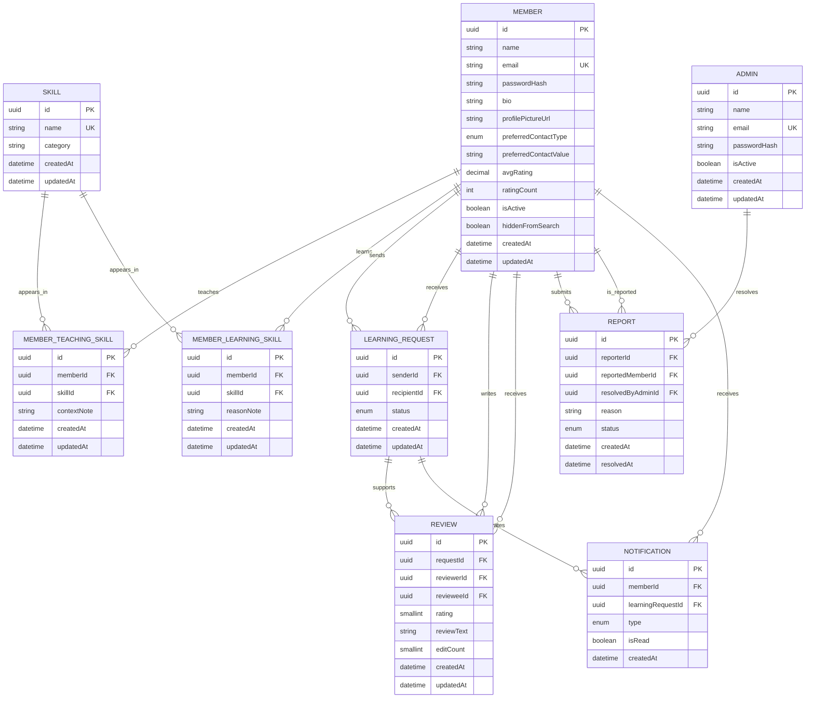
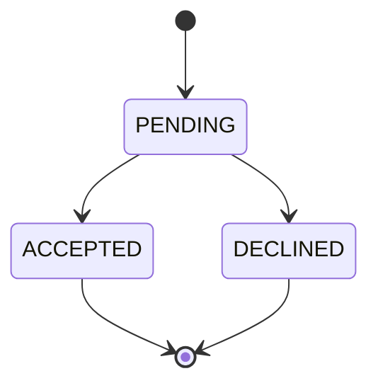
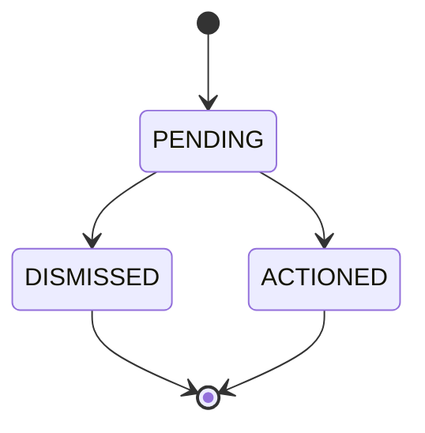
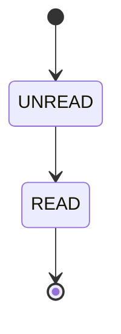

# ThoughtShare Database Design

**Document:** `THOUGHTSHARE_DATABASE_DESIGN.md`  
**Version:** 1.0  
**Database:** PostgreSQL 16+  
**ORM:** Prisma  
**Primary key strategy:** UUID  
**Migration strategy:** Prisma Migrate  
**Status:** Backend MVP Database Contract

---

## Table of Contents

1. [Purpose](#1-purpose)
2. [Database Principles](#2-database-principles)
3. [Logical Data Model](#3-logical-data-model)
4. [Complete ER Diagram](#4-complete-er-diagram)
5. [Entity Overview](#5-entity-overview)
6. [Table Definitions](#6-table-definitions)
7. [Prisma Schema](#7-prisma-schema)
8. [Relationships](#8-relationships)
9. [Indexes](#9-indexes)
10. [Constraints](#10-constraints)
11. [State Machines](#11-state-machines)
12. [Transactions](#12-transactions)
13. [Data Visibility and Privacy](#13-data-visibility-and-privacy)
14. [Delete and Retention Strategy](#14-delete-and-retention-strategy)
15. [Seed Data](#15-seed-data)
16. [Migration Strategy](#16-migration-strategy)
17. [Query Patterns](#17-query-patterns)
18. [Performance Strategy](#18-performance-strategy)
19. [Backup and Recovery](#19-backup-and-recovery)
20. [Database Testing](#20-database-testing)
21. [Open Decisions](#21-open-decisions)

---

## 1. Purpose

This document defines the persistent data architecture for ThoughtShare. It is the database-level companion to the API Contract and Backend Implementation Plan.

The design is optimized for the MVP's critical journey:

```text
Register
  -> Profile
  -> Add teaching/learning skills
  -> Search
  -> Send request
  -> Accept/decline
  -> Reveal contact information after acceptance
  -> Review
  -> Report/moderate
```

The database must preserve data integrity even when multiple API requests arrive concurrently or when a malicious client bypasses frontend validation.

---

## 2. Database Principles

1. PostgreSQL is the system of record.
2. Prisma is the application data-access layer.
3. UUIDs are used for externally exposed identifiers.
4. Foreign keys are enforced by PostgreSQL.
5. Business rules that depend on multiple rows are enforced by transactions and service logic.
6. Unique constraints provide the final protection against race conditions.
7. Passwords are stored only as bcrypt hashes.
8. Private contact values are never exposed by default queries.
9. Denormalized rating aggregates are updated transactionally.
10. Soft state flags (`isActive`, `hiddenFromSearch`) are preferred over destructive deletion for trust-and-safety decisions.
11. Prisma migrations are committed to version control.
12. Production migrations are applied through CI/CD, never manually edited in the database.

---

## 3. Logical Data Model

### Core entities

- `Member`: platform user.
- `Admin`: administrative identity.
- `Skill`: controlled skill library.
- `MemberTeachingSkill`: member-to-skill teaching association.
- `MemberLearningSkill`: member-to-skill learning association.
- `LearningRequest`: connection request and lifecycle.
- `Review`: rating and written feedback tied to an accepted request.
- `Report`: trust-and-safety report and resolution lifecycle.
- `Notification`: persisted refresh-based notification.

### Why join tables are explicit

Teaching and learning are two different relationships between the same `Member` and `Skill` entities. Explicit join tables allow each relationship to carry metadata:

- Teaching: `contextNote`.
- Learning: `reasonNote`.

They also allow independent limits of 5 teaching skills and 6 learning skills.

---

## 4. Complete ER Diagram



### Relationship summary

| Relationship | Cardinality | Meaning |
|---|---|---|
| Member -> TeachingSkill | 1:N | Member can teach multiple skills |
| Member -> LearningSkill | 1:N | Member can learn multiple skills |
| Skill -> TeachingSkill | 1:N | Skill can be taught by many members |
| Skill -> LearningSkill | 1:N | Skill can be learned by many members |
| Member -> Request as sender | 1:N | Member can send requests |
| Member -> Request as recipient | 1:N | Member can receive requests |
| Request -> Review | 1:N | Each participant can independently review the connection |
| Member -> Review as reviewer | 1:N | Member writes reviews |
| Member -> Review as reviewee | 1:N | Member receives reviews |
| Member -> Report as reporter | 1:N | Member submits reports |
| Member -> Report as reported | 1:N | Member can be reported |
| Admin -> Report | 1:N | Admin resolves reports |
| Member -> Notification | 1:N | Member receives notifications |
| Request -> Notification | 1:N | Request events generate notifications |

---

## 5. Entity Overview

| Entity | Purpose | Lifecycle |
|---|---|---|
| Member | User identity and profile | Active/deactivated |
| Admin | Trust and platform administration | Active/deactivated |
| Skill | Controlled vocabulary | Admin managed |
| MemberTeachingSkill | Teaching association | Created/updated/deleted |
| MemberLearningSkill | Learning association | Created/updated/deleted |
| LearningRequest | Connection lifecycle | Pending/accepted/declined |
| Review | Feedback and rating | Created/edited/moderated |
| Report | Safety moderation case | Pending/dismissed/actioned |
| Notification | Refresh-based event notification | Unread/read |

---

## 6. Table Definitions

## 6.1 `Member`

| Column | PostgreSQL type | Null | Default | Constraints |
|---|---|---:|---|---|
| `id` | UUID | No | `gen_random_uuid()` | PK |
| `name` | VARCHAR(100) | No | - | length 2-100 |
| `email` | VARCHAR(255) | No | - | UNIQUE |
| `passwordHash` | VARCHAR(255) | No | - | bcrypt hash |
| `bio` | VARCHAR(500) | Yes | NULL | max 500 |
| `profilePictureUrl` | VARCHAR(500) | Yes | NULL | URL/storage key |
| `preferredContactType` | ENUM | Yes | NULL | controlled values |
| `preferredContactValue` | VARCHAR(255) | Yes | NULL | private |
| `avgRating` | DECIMAL(3,2) | No | 0 | 0-5 |
| `ratingCount` | INTEGER | No | 0 | >= 0 |
| `isActive` | BOOLEAN | No | true | login gate |
| `hiddenFromSearch` | BOOLEAN | No | false | discovery gate |
| `createdAt` | TIMESTAMPTZ | No | now() | |
| `updatedAt` | TIMESTAMPTZ | No | now() | |

### Indexes

- Unique index on `email`.
- Composite index on `(hiddenFromSearch, isActive, avgRating DESC, name ASC)`.
- Index on `avgRating DESC` is optional if the composite index is sufficient.

---

## 6.2 `Admin`

| Column | PostgreSQL type | Null | Default | Constraints |
|---|---|---:|---|---|
| `id` | UUID | No | `gen_random_uuid()` | PK |
| `name` | VARCHAR(100) | No | - | |
| `email` | VARCHAR(255) | No | - | UNIQUE |
| `passwordHash` | VARCHAR(255) | No | - | |
| `isActive` | BOOLEAN | No | true | login gate |
| `createdAt` | TIMESTAMPTZ | No | now() | |
| `updatedAt` | TIMESTAMPTZ | No | now() | |

---

## 6.3 `Skill`

| Column | PostgreSQL type | Null | Default | Constraints |
|---|---|---:|---|---|
| `id` | UUID | No | `gen_random_uuid()` | PK |
| `name` | VARCHAR(100) | No | - | UNIQUE |
| `category` | VARCHAR(100) | Yes | NULL | |
| `createdAt` | TIMESTAMPTZ | No | now() | |
| `updatedAt` | TIMESTAMPTZ | No | now() | |

Skill names should be normalized for uniqueness. Recommended rule: trim whitespace and compare case-insensitively at the service layer. PostgreSQL can additionally use a functional unique index on `LOWER(name)` if required.

---

## 6.4 `MemberTeachingSkill`

| Column | Type | Null | Constraints |
|---|---|---:|---|
| `id` | UUID | No | PK |
| `memberId` | UUID | No | FK Member, CASCADE |
| `skillId` | UUID | No | FK Skill, RESTRICT |
| `contextNote` | VARCHAR(300) | No | non-empty |
| `createdAt` | TIMESTAMPTZ | No | now() |
| `updatedAt` | TIMESTAMPTZ | No | now() |

Unique: `(memberId, skillId)`.

Maximum five rows per member is enforced in application service logic within a transaction.

---

## 6.5 `MemberLearningSkill`

Same structure as teaching skills, except:

- `reasonNote` is required.
- Maximum six rows per member.
- Unique `(memberId, skillId)`.

---

## 6.6 `LearningRequest`

| Column | Type | Null | Constraints |
|---|---|---:|---|
| `id` | UUID | No | PK |
| `senderId` | UUID | No | FK Member |
| `recipientId` | UUID | No | FK Member |
| `status` | ENUM | No | PENDING default |
| `createdAt` | TIMESTAMPTZ | No | now() |
| `updatedAt` | TIMESTAMPTZ | No | now() |

Check: `senderId <> recipientId`.

Partial unique index:

```sql
CREATE UNIQUE INDEX learning_request_one_pending_pair
ON "LearningRequest" ("senderId", "recipientId")
WHERE "status" = 'PENDING';
```

This protects against concurrent duplicate requests.

---

## 6.7 `Review`

| Column | Type | Null | Constraints |
|---|---|---:|---|
| `id` | UUID | No | PK |
| `requestId` | UUID | No | FK LearningRequest |
| `reviewerId` | UUID | No | FK Member |
| `revieweeId` | UUID | No | FK Member |
| `rating` | SMALLINT | No | 1-5 |
| `reviewText` | VARCHAR(1000) | No | non-empty |
| `editCount` | SMALLINT | No | 0 | max 2 by default |
| `createdAt` | TIMESTAMPTZ | No | now() | |
| `updatedAt` | TIMESTAMPTZ | No | now() | |

Unique: `(reviewerId, revieweeId, requestId)`.

Check: `reviewerId <> revieweeId`.

The database cannot alone guarantee that `requestId.status = ACCEPTED` and that the reviewer is one of the request participants. The service layer must validate this inside the transaction.

---

## 6.8 `Report`

| Column | Type | Null | Constraints |
|---|---|---:|---|
| `id` | UUID | No | PK |
| `reporterId` | UUID | No | FK Member |
| `reportedMemberId` | UUID | No | FK Member |
| `reason` | VARCHAR(500) | No | non-empty |
| `status` | ENUM | No | PENDING default |
| `createdAt` | TIMESTAMPTZ | No | now() |
| `resolvedAt` | TIMESTAMPTZ | Yes | NULL |
| `resolvedByAdminId` | UUID | Yes | FK Admin |

Check: `reporterId <> reportedMemberId`.

Recommended partial unique index to prevent duplicate pending reports from the same reporter against the same member:

```sql
CREATE UNIQUE INDEX report_one_pending_per_reporter_target
ON "Report" ("reporterId", "reportedMemberId")
WHERE "status" = 'PENDING';
```

---

## 6.9 `Notification`

| Column | Type | Null | Constraints |
|---|---|---:|---|
| `id` | UUID | No | PK |
| `memberId` | UUID | No | FK Member CASCADE |
| `learningRequestId` | UUID | Yes | FK Request SET NULL |
| `type` | ENUM | No | controlled event type |
| `isRead` | BOOLEAN | No | false |
| `createdAt` | TIMESTAMPTZ | No | now() |

Notification types:

- `NEW_REQUEST`
- `REQUEST_ACCEPTED`
- `REQUEST_DECLINED`

Indexes:

- `(memberId, isRead, createdAt DESC)`.
- `(learningRequestId)`.

---

## 7. Prisma Schema

```prisma
generator client {
  provider = "prisma-client-js"
}

datasource db {
  provider = "postgresql"
  url      = env("DATABASE_URL")
}

enum ContactType {
  EMAIL
  WHATSAPP
  PHONE
  INSTAGRAM
}

enum RequestStatus {
  PENDING
  ACCEPTED
  DECLINED
}

enum ReportStatus {
  PENDING
  DISMISSED
  ACTIONED
}

enum NotificationType {
  NEW_REQUEST
  REQUEST_ACCEPTED
  REQUEST_DECLINED
}

model Member {
  id                    String                 @id @default(uuid()) @db.Uuid
  name                  String                 @db.VarChar(100)
  email                 String                 @unique @db.VarChar(255)
  passwordHash          String                 @db.VarChar(255)
  bio                   String?                @db.VarChar(500)
  profilePictureUrl     String?                @db.VarChar(500)
  preferredContactType  ContactType?
  preferredContactValue String?                @db.VarChar(255)
  avgRating             Decimal                @default(0) @db.Decimal(3, 2)
  ratingCount           Int                    @default(0)
  isActive              Boolean                @default(true)
  hiddenFromSearch      Boolean                @default(false)
  createdAt             DateTime               @default(now())
  updatedAt             DateTime               @updatedAt

  teachingSkills        MemberTeachingSkill[]
  learningSkills        MemberLearningSkill[]
  sentRequests           LearningRequest[]      @relation("RequestSender")
  receivedRequests       LearningRequest[]      @relation("RequestRecipient")
  writtenReviews         Review[]               @relation("ReviewReviewer")
  receivedReviews        Review[]               @relation("ReviewReviewee")
  submittedReports       Report[]               @relation("ReportReporter")
  receivedReports        Report[]               @relation("ReportTarget")
  notifications          Notification[]

  @@index([hiddenFromSearch, isActive, avgRating, name])
  @@index([isActive])
  @@map("members")
}

model Admin {
  id                String   @id @default(uuid()) @db.Uuid
  name              String   @db.VarChar(100)
  email             String   @unique @db.VarChar(255)
  passwordHash      String   @db.VarChar(255)
  isActive          Boolean  @default(true)
  createdAt         DateTime @default(now())
  updatedAt         DateTime @updatedAt

  resolvedReports   Report[]

  @@map("admins")
}

model Skill {
  id              String                 @id @default(uuid()) @db.Uuid
  name            String                 @unique @db.VarChar(100)
  category        String?                @db.VarChar(100)
  createdAt       DateTime               @default(now())
  updatedAt       DateTime               @updatedAt

  teachingMembers MemberTeachingSkill[]
  learningMembers MemberLearningSkill[]

  @@index([category])
  @@map("skills")
}

model MemberTeachingSkill {
  id          String   @id @default(uuid()) @db.Uuid
  memberId    String   @db.Uuid
  skillId     String   @db.Uuid
  contextNote String   @db.VarChar(300)
  createdAt   DateTime @default(now())
  updatedAt   DateTime @updatedAt

  member      Member   @relation(fields: [memberId], references: [id], onDelete: Cascade)
  skill       Skill    @relation(fields: [skillId], references: [id], onDelete: Restrict)

  @@unique([memberId, skillId])
  @@index([memberId])
  @@index([skillId])
  @@map("member_teaching_skills")
}

model MemberLearningSkill {
  id         String   @id @default(uuid()) @db.Uuid
  memberId   String   @db.Uuid
  skillId    String   @db.Uuid
  reasonNote String   @db.VarChar(300)
  createdAt  DateTime @default(now())
  updatedAt  DateTime @updatedAt

  member     Member   @relation(fields: [memberId], references: [id], onDelete: Cascade)
  skill      Skill    @relation(fields: [skillId], references: [id], onDelete: Restrict)

  @@unique([memberId, skillId])
  @@index([memberId])
  @@index([skillId])
  @@map("member_learning_skills")
}

model LearningRequest {
  id             String          @id @default(uuid()) @db.Uuid
  senderId       String          @db.Uuid
  recipientId    String          @db.Uuid
  status         RequestStatus   @default(PENDING)
  createdAt      DateTime        @default(now())
  updatedAt      DateTime        @updatedAt

  sender         Member          @relation("RequestSender", fields: [senderId], references: [id], onDelete: Restrict)
  recipient      Member          @relation("RequestRecipient", fields: [recipientId], references: [id], onDelete: Restrict)
  reviews        Review[]
  notifications  Notification[]

  @@index([recipientId, status])
  @@index([senderId, status])
  @@index([createdAt])
  @@map("learning_requests")
}

model Review {
  id          String          @id @default(uuid()) @db.Uuid
  requestId   String          @db.Uuid
  reviewerId  String          @db.Uuid
  revieweeId  String          @db.Uuid
  rating      Int             @db.SmallInt
  reviewText  String          @db.VarChar(1000)
  editCount   Int             @default(0) @db.SmallInt
  createdAt   DateTime        @default(now())
  updatedAt   DateTime        @updatedAt

  request     LearningRequest @relation(fields: [requestId], references: [id], onDelete: Restrict)
  reviewer    Member          @relation("ReviewReviewer", fields: [reviewerId], references: [id], onDelete: Restrict)
  reviewee    Member          @relation("ReviewReviewee", fields: [revieweeId], references: [id], onDelete: Restrict)

  @@unique([reviewerId, revieweeId, requestId])
  @@index([revieweeId])
  @@index([requestId])
  @@map("reviews")
}

model Report {
  id                String       @id @default(uuid()) @db.Uuid
  reporterId        String       @db.Uuid
  reportedMemberId  String       @db.Uuid
  reason            String       @db.VarChar(500)
  status            ReportStatus @default(PENDING)
  createdAt         DateTime     @default(now())
  resolvedAt        DateTime?
  resolvedByAdminId String?      @db.Uuid

  reporter          Member       @relation("ReportReporter", fields: [reporterId], references: [id], onDelete: Restrict)
  reportedMember    Member       @relation("ReportTarget", fields: [reportedMemberId], references: [id], onDelete: Restrict)
  resolvedByAdmin   Admin?       @relation(fields: [resolvedByAdminId], references: [id], onDelete: SetNull)

  @@index([reportedMemberId, status])
  @@index([reporterId, reportedMemberId, status])
  @@index([status, createdAt])
  @@map("reports")
}

model Notification {
  id                String           @id @default(uuid()) @db.Uuid
  memberId          String           @db.Uuid
  learningRequestId String?          @db.Uuid
  type              NotificationType
  isRead            Boolean          @default(false)
  createdAt         DateTime         @default(now())

  member            Member           @relation(fields: [memberId], references: [id], onDelete: Cascade)
  learningRequest   LearningRequest? @relation(fields: [learningRequestId], references: [id], onDelete: SetNull)

  @@index([memberId, isRead, createdAt])
  @@index([learningRequestId])
  @@map("notifications")
}
```

### Prisma note on partial unique indexes

Prisma's schema language may not express every PostgreSQL partial-index requirement directly. The application should use a custom SQL migration for the pending-request and pending-report partial unique indexes.

The migration should contain:

```sql
CREATE UNIQUE INDEX learning_request_one_pending_pair
ON "learning_requests" ("senderId", "recipientId")
WHERE "status" = 'PENDING';

CREATE UNIQUE INDEX report_one_pending_per_reporter_target
ON "reports" ("reporterId", "reportedMemberId")
WHERE "status" = 'PENDING';
```

The exact generated table/column quoting must match the project's Prisma migration output.

---

## 8. Relationships

### Member and Skill

A member may teach and learn the same skill. These are independent relationships. For example:

```text
Member: Zee
  teaches: Excel
  learns: Video Editing
```

The same member could also teach and learn Excel if their profile expresses both relationships.

### Member and LearningRequest

`LearningRequest.senderId` and `LearningRequest.recipientId` both point to `Member.id`. Prisma therefore requires named relations.

### Request and Review

A request represents the connection context. A review references the request so the backend can prove that:

1. The reviewer was a participant.
2. The request was accepted.
3. The review is tied to a real connection.
4. The reviewer has not already reviewed that connection in the same direction.

### Report and Admin

`resolvedByAdminId` is nullable until resolution. Dismissing or actioning a report populates it.

---

## 9. Indexes

### Required indexes

| Table | Index | Reason |
|---|---|---|
| members | unique email | Login and uniqueness |
| members | hiddenFromSearch/isActive/rating/name | Search discovery |
| skills | unique name | Controlled vocabulary |
| skills | category | Category filtering |
| teaching | memberId | Profile loading |
| teaching | skillId | Search by teaching skill |
| learning | memberId | Profile loading |
| learning | skillId | Search by learning skill |
| requests | recipientId/status | Pending inbox |
| requests | senderId/status | Outgoing requests |
| reviews | revieweeId | Rating aggregation |
| reports | reportedMemberId/status | Hide/restore logic |
| reports | status/createdAt | Admin moderation queue |
| notifications | memberId/isRead/createdAt | Notification inbox |

### Index design principle

Do not add indexes merely because a column exists. Each index must support a known query pattern. Excessive indexing increases write cost and storage.

---

## 10. Constraints

### Database constraints

- Member email unique.
- Admin email unique.
- Skill name unique.
- Teaching association unique per member/skill.
- Learning association unique per member/skill.
- Rating range 1-5.
- Review edit count non-negative.
- Sender cannot equal recipient.
- Reporter cannot equal reported member.
- Reviewer cannot equal reviewee.
- Foreign keys enforced.
- Pending request pair unique.
- Pending report pair unique.

### Application constraints

- Teaching skill maximum: 5.
- Learning skill maximum: 6.
- Bio maximum: 500.
- Review edit maximum: 2.
- Accepted request required before review.
- Only recipient can accept/decline.
- Only owner can edit review.
- Contact visibility requires accepted connection.

---

## 11. State Machines

### Learning Request



No transition is permitted from `ACCEPTED` or `DECLINED` to another state in MVP.

### Report



### Notification



---

## 12. Transactions

### Request acceptance

Must be atomic:

```text
BEGIN
  Verify request is PENDING
  Verify current user is recipient
  UPDATE request -> ACCEPTED
  INSERT REQUEST_ACCEPTED notification
COMMIT
```

### Review creation

```text
BEGIN
  Verify accepted request
  Verify reviewer is participant
  Verify no duplicate review
  INSERT review
  SELECT AVG(rating), COUNT(*)
  UPDATE member aggregate
COMMIT
```

### Review edit

```text
BEGIN
  Verify reviewer owns review
  Verify editCount < 2
  UPDATE review
  Recalculate aggregate
  UPDATE member aggregate
COMMIT
```

### Report submission

```text
BEGIN
  Verify target exists
  Verify reporter != target
  Insert report
  Set target.hiddenFromSearch = true
COMMIT
```

### Report dismissal

```text
BEGIN
  Resolve report
  Check for remaining PENDING reports against target
  If none, set hiddenFromSearch = false
COMMIT
```

### Report action

```text
BEGIN
  Resolve report as ACTIONED
  Set target.isActive = false
  Set target.hiddenFromSearch = true
COMMIT
```

---

## 13. Data Visibility and Privacy

### Passwords

`passwordHash` is write-only from an API perspective. It is used only for credential verification.

### Contact details

Contact information is private by default.

Visibility conditions:

```text
viewer.id == member.id
OR
exists accepted request connecting viewer and member
```

The preferred implementation is a repository query that conditionally selects contact fields, rather than fetching private fields and removing them later.

### Search

Search must exclude:

```sql
WHERE isActive = true
  AND hiddenFromSearch = false
```

This filtering occurs before pagination.

### Reports

A report does not delete a member. It changes discovery state immediately while preserving the member and their historical relationships.

---

## 14. Delete and Retention Strategy

### Member deletion

Hard deletion is not recommended for MVP because a member may be referenced by requests, reviews, and reports. Admin action should deactivate the account.

### Skill deletion

`RESTRICT` if referenced. This prevents historical profile associations from silently disappearing.

### Review deletion

Admin moderation may hard-delete a violating review. The rating aggregate must be recalculated in the same transaction.

### Request deletion

Do not hard-delete accepted or declined requests. The request is the historical connection record supporting reviews and notifications.

### Notifications

Notifications can be retained for a defined period, such as 90-365 days, depending on product requirements. MVP can retain them indefinitely if data volume is small.

---

## 15. Seed Data

The seed script should create:

### Skill library

At least 30-50 curated skills across categories such as:

- Productivity.
- Data and Analytics.
- Finance.
- Software Development.
- Design.
- Creative Media.
- Communication.
- Business.

The exact skill taxonomy must be approved before the search demo is finalized.

### Demo members

Create multiple members with:

- Different teaching skills.
- Different learning skills.
- Different ratings.
- Equal-rating pairs to test alphabetical tie-break.
- Accepted and declined requests.
- Pending requests.
- At least one report scenario.

Seed scripts must be idempotent or use deterministic upsert operations.

---

## 16. Migration Strategy

### Local development

```bash
npx prisma migrate dev --name init
npx prisma generate
npx prisma db seed
```

### CI

```bash
npx prisma migrate deploy
```

### Production

1. Build application image.
2. Run migration job.
3. Verify migration success.
4. Deploy application.
5. Run health check.
6. Roll back application if health check fails.

Database migrations are forward-only in production. Destructive migrations require explicit review and a backup plan.

---

## 17. Query Patterns

### Search teaching skills

```sql
SELECT m.*
FROM members m
JOIN member_teaching_skills mts ON mts.member_id = m.id
JOIN skills s ON s.id = mts.skill_id
WHERE s.id = $1
  AND m.is_active = true
  AND m.hidden_from_search = false
ORDER BY m.avg_rating DESC, m.name ASC
LIMIT $2 OFFSET $3;
```

### Accepted connection check

Conceptually:

```sql
WHERE status = 'ACCEPTED'
AND (
  (sender_id = viewer_id AND recipient_id = target_id)
  OR
  (sender_id = target_id AND recipient_id = viewer_id)
)
```

### Pending report check

```sql
SELECT 1
FROM reports
WHERE reported_member_id = $1
  AND status = 'PENDING'
LIMIT 1;
```

---

## 18. Performance Strategy

### MVP target

Optimize for correctness first, then measure.

Recommended initial targets:

- P95 simple read endpoint: < 300 ms under expected MVP load.
- P95 authenticated request mutation: < 500 ms under expected MVP load.
- Database connection pool sized for deployment environment.
- No N+1 queries on member profile/search endpoints.

### Prisma query rules

- Use `select` to limit fields.
- Avoid `include` trees that fetch unnecessary data.
- Paginate collections.
- Use indexes aligned with real query predicates.
- Use transactions only where atomicity is required.
- Never expose Prisma model objects directly from controllers.

---

## 19. Backup and Recovery

Production PostgreSQL should have:

- Automated daily backups.
- Point-in-time recovery where supported.
- Encrypted backup storage.
- Documented restore procedure.
- Periodic restore tests.

Minimum recovery objectives should be agreed with Cloud/DevOps. For a capstone MVP, a practical target is to demonstrate that a database backup can be restored successfully before final demo day.

---

## 20. Database Testing

Tests should cover:

### Constraints

- Duplicate email rejected.
- Duplicate skill rejected.
- Duplicate member-skill rejected.
- Self-request rejected.
- Self-report rejected.
- Rating outside 1-5 rejected.
- Duplicate pending request rejected under concurrency.
- Duplicate pending report rejected.

### Relationships

- Member deletion behavior.
- Skill deletion restricted when referenced.
- Notification request relation nullable after request deletion if ever allowed.
- Report admin relation nullable before resolution.

### Transactions

- Failed request acceptance does not create notification.
- Failed review creation does not update rating aggregate.
- Failed report submission does not hide member.
- Failed admin action does not partially deactivate member.

### Aggregate correctness

Test:

```text
No reviews -> avgRating 0, ratingCount 0
1 review -> exact rating
2 reviews -> arithmetic mean
Edit review -> aggregate changes
Admin deletes review -> aggregate changes
```

---

## 21. Open Decisions

### 21.1 Preferred contact field shape

Current design: `preferredContactType` + `preferredContactValue`.

Decision owner: Product + Frontend + Backend.

### 21.2 Skill library source

Current recommendation: curated seed list of 30-50 skills for MVP.

Decision deadline: end of Week 1.

### 21.3 Search mode

Current API supports `teach` and `learn`. Default is `teach`.

Product must confirm whether both modes ship in MVP.

### 21.4 Notification persistence

Current recommendation: persist notifications.

Alternative: derive events on demand. Persisted notifications are preferred because they support unread state and deterministic history.

### 21.5 Review edit policy

Current default: maximum 2 edits.

Alternative: time-based editing window.

MVP recommendation: retain two-edit rule unless UX testing proves it inadequate.

---

## Appendix A - Data Integrity Checklist

- [ ] All foreign keys exist.
- [ ] All foreign keys have intentional delete behavior.
- [ ] All unique constraints exist.
- [ ] Partial unique indexes created through migration.
- [ ] Rating check constraint exists.
- [ ] Self-request and self-report rules enforced.
- [ ] Skill count limits enforced in services.
- [ ] Contact fields excluded from public queries.
- [ ] Password hash excluded from API serializers.
- [ ] Search excludes hidden and inactive members.
- [ ] Rating aggregates recalculated transactionally.
- [ ] Request acceptance is atomic.
- [ ] Report resolution is atomic.
- [ ] Prisma migration tested in CI.
- [ ] Seed script is repeatable.
- [ ] Backup restore procedure documented.

---

## Appendix B - Recommended Repository Layout

```text
database/
└── prisma/
    ├── schema.prisma
    ├── seed.js
    └── migrations/
        └── YYYYMMDD_init/
            └── migration.sql
```
